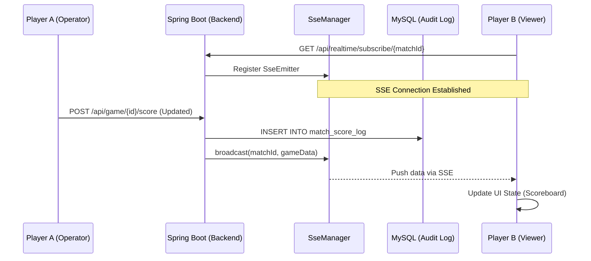

# 系统架构设计说明书 (System Architecture Specification)

## 1. 核心设计原则 (Design Principles)
*   **多租户隔离 (Multi-tenancy)**: 所有核心实体（Player, MatchEvent）均通过 `club_id` 进行逻辑隔离，支持未来横向扩展至多俱乐部平台。
*   **审计留痕 (Audit Trail)**: 针对高频变动的核心数据（如比分），系统不仅记录最终状态，还通过 `match_score_log` 实现全量版本快照记录。
*   **低延迟交互 (Real-time)**: 采用 **SSE (Server-Sent Events)** 技术栈，实现“服务端推”模式，确保比分变动在毫秒级同步至所有在线终端。

## 2. 技术栈深度定义 (Technology Stack)
*   **通信协议**: RESTful API + SSE (Real-time updates)
*   **并发控制**: 业务互斥锁 (Business Mutual Exclusion) + 数据库行级锁。
*   **前端状态**: React Hooks + SSE EventSource 订阅模式。

## 3. 实时性架构 (Real-time Architecture)

## 4. 多租户数据模型映射
目前系统采用 **共享数据库、共享 Schema (Shared Schema)** 的租户模式：
*   所有查询强制携带 `club_id` 过滤（当前默认 1）。
*   通过 MyBatis-Plus 的 `Interceptor` 拦截器可实现自动化的租户 ID 注入（待实现）。

## 5. 开发者建议
重构或二次开发时，如涉及比分或状态变更，必须调用 `MatchGameServiceImpl.logAndBroadcast` 方法以确保数据一致性与前端实时同步。
