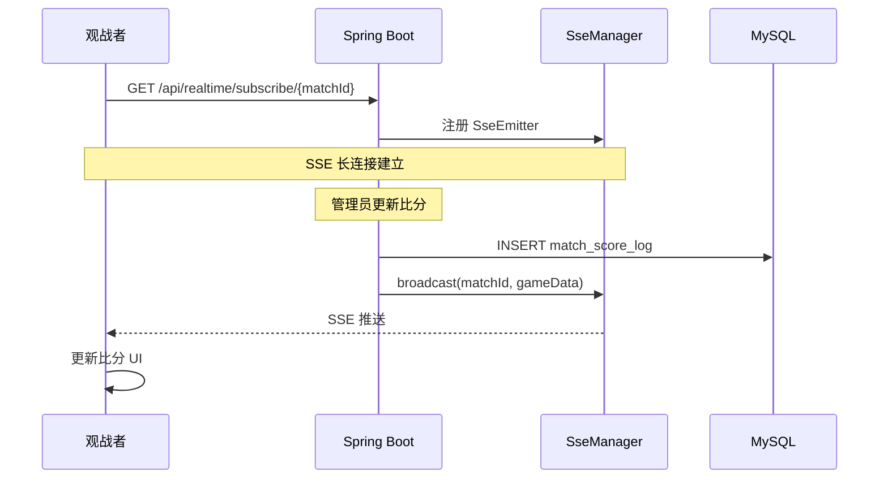

# PitchMaster 系统架构

---

## 1. 核心设计原则

- **多租户隔离**：`tournament_id` 是顶层隔离键。`player_rating_profile`、`player_stat`、`player_rating_history` 均按 `(player_id, tournament_id)` 唯一隔离；`Club` 归属于具体 Tournament。
- **审计留痕**：比分变动写入 `match_score_log`；评分变动写入 `player_rating_history`，每次记录维度、来源、操作人、前后值。
- **实时推送**：SSE (Server-Sent Events)，`SseManager` 基于 `matchId` 维护连接池，精准广播赛事级事件。
- **Controller 只做编排**：业务逻辑下沉到 Service 层；Controller 仅负责参数校验、调用 Service、包装响应。

---

## 2. 技术栈

| 层 | 技术 |
|----|------|
| 后端框架 | Spring Boot 3.4 + MyBatis-Plus |
| 认证授权 | Apache Shiro（角色：`admin` / `player` / `platform_admin`） |
| 数据库迁移 | Flyway（`src/main/resources/db/migration/`，当前 V18） |
| 实时推送 | SSE (`SseManager`) |
| 前端框架 | React 18 + TypeScript + Vite |
| 前端 UI | Ant Design Mobile + Tailwind CSS（主色 `#1DB954`） |
| 前端状态 | Zustand |
| 前端图表 | ECharts（评分雷达图） |
| HTTP 客户端 | Axios（`withCredentials: true`） |

---

## 3. 主要类结构

```
controller/
├── AuthController            # 登录/登出
├── MatchController           # 赛事查询、报名、分组
├── MatchAdminController      # 赛事生命周期管理（admin）
├── MatchGameController       # 场次比分操作
├── GameParticipantController # 单场球员数据录入
├── PlayerController          # 球员档案 + 评分查询
├── PlayerAdminController     # 评分人工修正（admin）
├── TournamentController      # Tournament CRUD
├── TournamentPlayerController# 球员加入/离开 Tournament
└── RealTimeController        # SSE 订阅端点

service/
├── MatchService              # 赛事业务主流程
├── RatingService             # FM 评分计算与衰减
├── PlayerService             # 球员档案 + 人工评分修正
├── TournamentPlayerService   # Tournament 内球员生命周期
├── PlayerMutualRatingService # 赛后互评 + MVP 投票
└── MatchRegistrationService  # 报名状态管理

strategy/  （策略模式，可扩展）
├── GroupingStrategy          # 分组策略接口
├── GroupingStrategyFactory   # 策略工厂（按名称获取）
└── impl/
    ├── SimpleSkillBalanceStrategy  # 当前默认：蛇形 Snake Draft
    └── EloRatingStrategyImpl       # Elo 评分策略（保留扩展）
```

---

## 4. 实时推送架构



---

## 5. 异常处理规范

`GlobalExceptionHandler` 统一拦截，返回标准 `Result` 格式：

| 异常类型 | HTTP 状态 |
|---------|----------|
| `UnauthenticatedException` | 401 |
| `AuthorizationException` | 403 |
| `IllegalArgumentException` / `IllegalStateException` | 400 |
| `Exception` | 500 |
