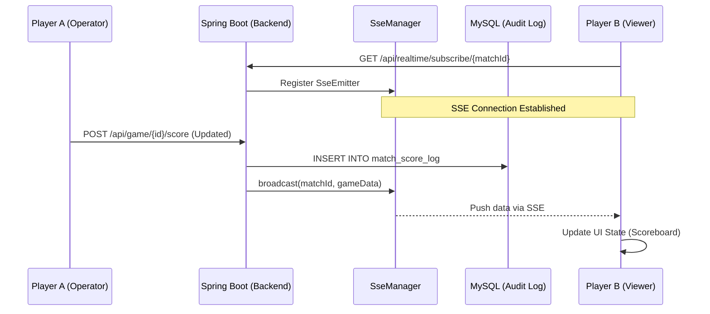

# 系统架构设计说明书 (System Architecture Specification)

## 1. 核心设计原则 (Design Principles)
*   **多层多租户隔离 (Multi-tenancy)**: 
    - **L1 (Tournament)**: 赛事级物理隔离（租户标识：`tournament_id`），支持多赛事平行运行。
    - **L2 (Club)**: 组织级逻辑隔离（租户标识：`real_club_id`），支持多俱乐部归属管理。
*   **审计留痕 (Audit Trail)**: 针对高频变动的核心数据（如比分），系统不仅记录最终状态，还通过 `match_score_log` 实现全量版本快照记录。
*   **低延迟交互 (Real-time)**: 采用 **SSE (Server-Sent Events)** 技术栈，实现“服务端推”模式，确保比分变动在毫秒级同步至所有在线终端。

## 2. 技术栈深度定义 (Technology Stack)
*   **通信协议**: RESTful API + SSE (Real-time updates)
*   **并发控制**: 业务互斥锁 (Business Mutual Exclusion) + 数据库行级锁 + 管理员编辑乐观锁定 (`lock_user_id`)。
*   **前端状态**: React Hooks + SSE EventSource 订阅模式。
*   **异常处理**: 全局异常处理器 (`GlobalExceptionHandler`) 统一拦截并转换异常为标准 `Result` 格式响应，确保前后端契约一致性。
    - **权限异常** (`AuthorizationException`): 返回 403 状态码
    - **认证异常** (`UnauthenticatedException`): 返回 401 状态码
    - **业务异常** (`IllegalArgumentException`, `IllegalStateException`): 返回 400 状态码并携带具体错误信息
    - **系统异常** (`Exception`): 返回 500 状态码并记录详细日志

## 3. 实时性架构 (Real-time Architecture)

## 4. 多租户数据模型映射
目前系统采用 **共享数据库、共享 Schema (Shared Schema)** 的租户模式：
*   **当前阶段**: 已完成从单一 `club_id` 到 `tournament_id` + `real_club_id` 的重构（参见 `V12` 迁移脚本）。
*   **强制过滤**: 应用层通过 MyBatis-Plus 的拦截器机制，在 `Match` 和 `Player` 相关的查询中强制注入 `tournament_id`。
*   **未来演进**: 动态租户解析（基于请求头、子域名或认证上下文）。

## 5. 核心业务流程与审计
系统对比分变动采取“双轨制”处理：
1.  **状态持久化**: 直接更新 `match_game` 表的 `score_a`, `score_b`。
2.  **流水记录**: 同步向 `match_score_log` 插入版本记录，该记录作为前端 SSE 推送的数据载体。
3.  **实时分发**: 通过 `SseManager` 维护基于 `match_id` 的连接池，实现精准的“赛事级”广播，避免不必要的全站推送。
