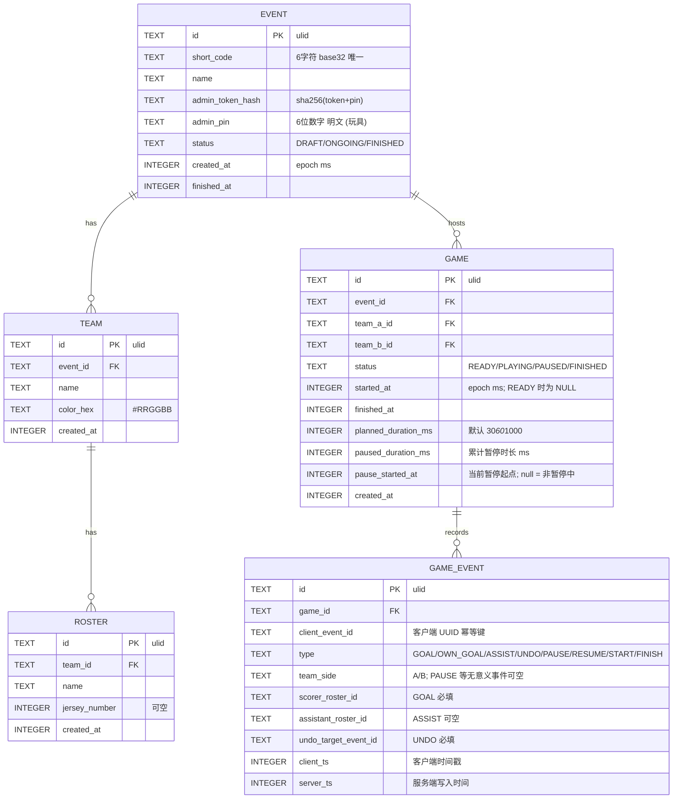

# PitchMaster v2 · 技术架构蓝图

> **状态**：草案 v0.1
> **配套**：[`../DEVELOPMENT_PLAN.md`](../DEVELOPMENT_PLAN.md)（路线 + 阶段） · [`../AGENTS.md`](../AGENTS.md)（AI 上下文）
>
> 本文件是 **技术参考的唯一真源**。DDL、API、算法、目录约定一律在此维护。开发者写代码前先 grep 本文件。

---

## 1. 系统拓扑

```
                ┌─────────────────────────────────────┐
                │     用户设备 (浏览器 PWA)            │
                │  ┌───────────────────────────────┐  │
                │  │ React + Vite + Tailwind       │  │
                │  │ Zustand (UI state)            │  │
                │  │ IndexedDB outbox (离线队列)   │  │
                │  │ EventSource (SSE 订阅)        │  │
                │  └───────────────────────────────┘  │
                └────────────┬────────────────────────┘
                             │ HTTPS
                ┌────────────▼────────────────────────┐
                │ Caddy (auto HTTPS)                   │
                │   reverse_proxy → :3000              │
                └────────────┬────────────────────────┘
                             │
                ┌────────────▼────────────────────────┐
                │  Node 20 + Hono (单进程)             │
                │  ┌────────────────────────────────┐ │
                │  │ Routes  (REST)                 │ │
                │  │ Services (业务)                │ │
                │  │ Drizzle ORM                    │ │
                │  │ SSE Broker (in-memory)         │ │
                │  │ Satori (海报渲染)              │ │
                │  └────────────────────────────────┘ │
                └────────────┬────────────────────────┘
                             │
                ┌────────────▼────────────────────────┐
                │  SQLite 文件 (WAL 模式)              │
                │  /var/lib/pitchmaster/data.db        │
                └─────────────────────────────────────┘
```

**关键约束**：
- 单进程 Node 服务器（不需要集群；玩具场景）
- SQLite 单文件，WAL 模式，备份 = `cp`
- SSE 连接池在 Node 进程内存，进程重启即重连（前端自动）
- 服务端持有"权威时间"（所有 `created_at`、`started_at` 都以 server clock 为准）

---

## 2. 目录结构

```
pitch-master/
├── AGENTS.md                       # AI 上下文（合并后唯一）
├── DEVELOPMENT_PLAN.md             # 路线 + 阶段 + 验收
├── README.md                       # 用户角度的简介与快速上手
├── docs/
│   ├── ARCHITECTURE_V2.md          # 本文件
│   └── DECISIONS.md                # ADR 记录（重大决策变更追加）
├── legacy/                         # v1 全量归档（只读参考）
│   ├── README.md                   # 说明"已废弃，仅参考"
│   ├── backend/                    # 原 src/main, src/test
│   ├── frontend/                   # 原 frontend/
│   ├── docs-v1/                    # 原 docs/
│   └── deploy-v1/                  # 原 deploy/
├── backend/                        # v2 Node + Hono 后端
│   ├── src/
│   │   ├── app.ts                  # Hono 入口
│   │   ├── routes/
│   │   │   ├── events.ts
│   │   │   ├── teams.ts
│   │   │   ├── games.ts
│   │   │   ├── events-stream.ts    # SSE
│   │   │   └── poster.ts
│   │   ├── services/
│   │   │   ├── event.service.ts
│   │   │   ├── game.service.ts
│   │   │   ├── timer.service.ts
│   │   │   ├── outbox.service.ts
│   │   │   └── poster.service.ts
│   │   ├── db/
│   │   │   ├── schema.ts           # Drizzle schema
│   │   │   ├── client.ts           # better-sqlite3 实例
│   │   │   └── migrations/         # drizzle-kit 生成
│   │   ├── lib/
│   │   │   ├── sse-broker.ts
│   │   │   ├── short-code.ts       # 6 位 base32 生成
│   │   │   └── auth.ts             # adminToken / PIN 校验
│   │   └── assets/
│   │       └── fonts/
│   │           └── NotoSansSC-subset.ttf
│   ├── tests/
│   │   ├── game.service.test.ts
│   │   ├── timer.service.test.ts
│   │   └── outbox.service.test.ts
│   ├── drizzle.config.ts
│   ├── package.json
│   ├── tsconfig.json
│   └── vitest.config.ts
├── web/                            # v2 React + Vite + PWA 前端
│   ├── src/
│   │   ├── main.tsx
│   │   ├── App.tsx
│   │   ├── routes/                 # React Router v6
│   │   ├── components/
│   │   │   ├── ui/                 # radix-based 基础组件
│   │   │   └── ...
│   │   ├── pages/
│   │   ├── stores/                 # Zustand
│   │   ├── api/                    # 调用后端
│   │   ├── outbox/                 # IndexedDB 队列
│   │   ├── pwa/                    # SW 钩子
│   │   └── styles/
│   ├── public/
│   ├── index.html
│   ├── vite.config.ts
│   └── package.json
└── deploy/
    ├── scripts/
    │   ├── install.sh
    │   ├── upgrade.sh
    │   └── backup.sh
    ├── systemd/
    │   └── pitchmaster-v2.service
    └── caddy/
        └── Caddyfile
```

---

## 3. 数据模型与 DDL

### 3.1 ER 概览



### 3.2 索引

```sql
CREATE UNIQUE INDEX idx_event_short_code ON event(short_code);
CREATE INDEX idx_team_event ON team(event_id);
CREATE INDEX idx_roster_team ON roster(team_id);
CREATE INDEX idx_game_event ON game(event_id);
CREATE INDEX idx_game_event_game ON game_event(game_id, server_ts);
CREATE UNIQUE INDEX idx_game_event_idem ON game_event(game_id, client_event_id);
```

### 3.3 派生数据（不存储，查询时计算）

| 派生项 | 公式 |
|---|---|
| 当前比分 | `count(GOAL where team_side=A and not undone) + count(OWN_GOAL where team_side=B and not undone) - ...` |
| 已用时（ms） | `now - started_at - paused_duration_ms - (pause_started_at ? now - pause_started_at : 0)` |
| 剩余时间 | `planned_duration_ms - 已用时` |
| MVP | 进球+助攻最多的 roster；并列取较早出现者 |
| 射手榜 | group by scorer_roster_id, count desc |

---

## 4. API 契约

### 4.1 全局规范

- 所有响应统一：`{ ok: true, data: ... }` 或 `{ ok: false, error: { code, message } }`
- HTTP 状态语义化（200/201/400/401/404/409/500）
- 鉴权方式：写接口需要 `Authorization: Bearer <adminToken>` 或 `?pin=<6位PIN>`
- 时间戳：epoch ms (UTC)，前端显示时转本地时区

### 4.2 端点列表（完整）

| Method | Path | 权限 | 描述 |
|---|---|---|---|
| GET | `/api/time` | 公开 | 返回 `{serverNow: 1718712345678}` 用于时钟校准 |
| POST | `/api/events` | 公开 | 创建活动；返回 `{id, shortCode, adminToken, pin}` |
| GET | `/api/events/:shortCode` | 公开 | 获取活动详情（含 teams + games 列表，不含 adminToken） |
| PATCH | `/api/events/:id` | Admin | 更新名字 / 标记结束 |
| POST | `/api/events/:id/teams` | Admin | 创建队伍 `{name, colorHex?}` |
| PATCH | `/api/teams/:id` | Admin | 更新 |
| DELETE | `/api/teams/:id` | Admin | 删除（队伍下无场次时允许） |
| POST | `/api/teams/:id/roster` | Admin | 批量加人 `{names: ['张三','李四']}` |
| DELETE | `/api/roster/:id` | Admin | 移除队员（未参与场次时） |
| POST | `/api/events/:id/games` | Admin | 创建场次 `{teamAId, teamBId, plannedDurationMs?}` |
| GET | `/api/games/:id` | 公开 | 详情（含事件流 + 派生比分） |
| POST | `/api/games/:id/start` | Admin | 开赛（写 `started_at = now`） |
| POST | `/api/games/:id/pause` | Admin | 暂停 |
| POST | `/api/games/:id/resume` | Admin | 恢复 |
| POST | `/api/games/:id/finish` | Admin | 结束 |
| POST | `/api/games/:id/events` | Admin | 单条事件 |
| POST | `/api/games/:id/events/batch` | Admin | 批量事件（离线 replay） |
| DELETE | `/api/games/:id/events/:eventId` | Admin | 撤销事件（写入 UNDO 而非物理删除） |
| GET | `/api/games/:id/stream` | 公开 | SSE 订阅 |
| GET | `/api/events/:id/report` | 公开 | H5 战报数据 JSON |
| GET | `/api/events/:id/poster.png` | 公开 | 渲染海报 |
| GET | `/healthz` | 公开 | `{ok:true, version, uptime}` |

### 4.3 关键请求/响应样例

**POST /api/events**
```json
// Request
{ "name": "周二夜场" }

// Response 201
{
  "ok": true,
  "data": {
    "id": "01HZ...",
    "shortCode": "A4F9KQ",
    "adminToken": "tok_a1b2c3d4e5...",
    "pin": "823517"
  }
}
```

**POST /api/games/:id/events**
```json
// Request
{
  "clientEventId": "uuid-v4-xxxx",
  "type": "GOAL",
  "teamSide": "A",
  "scorerRosterId": "01HZ...",
  "assistantRosterId": "01HZ...",
  "clientTs": 1718712345678
}

// Response 201
{
  "ok": true,
  "data": {
    "event": { /* 完整 game_event 记录 */ },
    "scoreA": 2,
    "scoreB": 1
  }
}
```

**SSE 帧格式**（`/api/games/:id/stream`）
```
event: game_update
data: {"type":"GOAL","gameEvent":{...},"scoreA":2,"scoreB":1,"elapsedMs":824000}

event: timer_tick
data: {"elapsedMs":830000,"status":"PLAYING"}
```

---

## 5. 鉴权机制（极简版）

### 5.1 设计

- 创建活动时服务端生成两段秘密：
  - `adminToken`：长随机字符串（32 字节 base64url），存 localStorage，写操作使用
  - `adminPin`：6 位数字（明文存 DB），用于"换设备"时拾回（用户手动输入）
- DB 存 `admin_token_hash = sha256(adminToken + pin)`（不可逆，但 pin 在 DB 明文用于换设备校验）
- 写接口校验顺序：
  1. 优先校验 `Authorization: Bearer <token>` → 用 `sha256(token + db.pin)` 比对 `admin_token_hash`
  2. 退化校验 `?pin=XXXXXX` → 直接比对 `db.admin_pin`，校验通过后返回新的 `adminToken` 给前端存

### 5.2 安全说明

> ⚠️ 这是"玩具级"安全设计。明文 PIN 入库、无限速、无审计。仅适用于 §决策 D3 的小圈子场景。任何"对外开放注册"的想法都需要先重做这一节。

---

## 6. 离线同步机制

### 6.1 客户端 outbox

IndexedDB store `outbox`：
```ts
interface OutboxItem {
  id: string;              // uuid v4
  gameId: string;
  endpoint: string;        // 'POST /api/games/xxx/events'
  payload: any;            // 业务 body
  clientTs: number;        // 写入时的客户端 ms
  status: 'PENDING' | 'SENDING' | 'FAILED';
  retryCount: number;
  lastError?: string;
}
```

### 6.2 写流程

```
用户点击 GOAL
  ↓
1. UI optimistically 更新（Zustand store 立即 +1）
  ↓
2. 写入 IndexedDB outbox (status=PENDING)
  ↓
3. 立即触发 worker.flush()（非阻塞）
  ↓
worker.flush():
  - 取所有 PENDING 项，按 clientTs 升序
  - 同一 gameId 的项打包 POST /api/games/:id/events/batch
  - 成功 → 删除 outbox 条目
  - 失败 → status=FAILED, retryCount++（指数退避，最多 5 次）
```

### 6.3 服务端幂等

- 每条事件携带 `clientEventId`（UUID）
- DB 唯一约束 `(game_id, client_event_id)`
- 重复提交 → 服务端检测后返回 200 + 现有记录（视为成功）

### 6.4 冲突说明（v2 假设）

**v2 假设**：同一场比赛**只有一个管理员设备**在录入。其他设备只读。
- 该假设让我们彻底避开 CRDT / OT 的复杂度
- 如果未来 v3 需要多人协同录入，再引入 yjs 或类似方案

### 6.5 时钟纠偏

- 录入时 `clientTs = Date.now() + clientServerOffsetMs`
- `clientServerOffsetMs` 由 `GET /api/time` 校准，每 5 分钟自动重新校准
- 这避免了用户手机时间错乱导致事件顺序混乱

---

## 7. 战报渲染

### 7.1 H5 战报（路由）

`/events/:shortCode/report`：纯 React 页面，从 `GET /api/events/:id/report` 拉数据渲染。

### 7.2 图片海报（服务端 satori）

```ts
// backend/src/services/poster.service.ts
import satori from 'satori'
import { Resvg } from '@resvg/resvg-js'

const fontData = fs.readFileSync('./assets/fonts/NotoSansSC-subset.ttf')

export async function renderPoster(eventId: string): Promise<Buffer> {
  const data = await reportService.build(eventId)
  const svg = await satori(<PosterTemplate {...data} />, {
    width: 1080,
    height: 1920,
    fonts: [{ name: 'NotoSC', data: fontData }],
  })
  return new Resvg(svg).render().asPng()
}
```

### 7.3 模板设计（v2 默认）

文字优先、极简风格。版面：
```
┌──────────────────────────┐
│  🏆 {EVENT_NAME}          │
│  2026-06-18               │
├──────────────────────────┤
│  {TEAM_A}  3 - 2  {TEAM_B}│
│       (全场 50min)         │
├──────────────────────────┤
│  ⚽ 进球                  │
│  {TEAM_A}                 │
│   陈宇 ×2 (12', 47')      │
│   王勇 (33')              │
│  {TEAM_B}                 │
│   李雷 (8')              │
│   韩梅梅 (29')            │
├──────────────────────────┤
│  🅰 助攻                 │
│  陈宇×1, 王勇×1, 李雷×1   │
├──────────────────────────┤
│  ⭐ MVP                   │
│  陈宇 (2G/1A)            │
├──────────────────────────┤
│  Generated by PitchMaster │
└──────────────────────────┘
```

> 若 §待决 O3 决定要"装饰图形版"，提供第二个模板组件，按 query 参数选择。

---

## 8. 前端关键模块

### 8.1 状态管理（Zustand）

- `useEventStore`：当前活动元数据
- `useGameStore`：当前场次状态 + 事件流（optimistic）
- `useTimerStore`：派生计时（由 game.started_at + clientServerOffset 计算）
- `useOutboxStore`：未同步项数 + flush trigger
- `useNetworkStore`：在线状态（navigator.onLine + 主动探测）

### 8.2 路由

```
/                                          首页（活动列表）
/events/new                                创建活动
/events/:shortCode                         活动主页（公开只读 + 管理操作）
/events/:shortCode/setup                   配置队伍与队员（管理）
/events/:shortCode/report                  战报 H5
/games/new?eventId=...                     新建场次
/games/:id/record                          录入页（管理）
/games/:id                                 场次只读详情
/admin/restore                             凭 PIN 找回 adminToken
```

### 8.3 UI 设计令牌（Tailwind）

```js
// web/tailwind.config.js (节选)
extend: {
  colors: {
    primary: '#10b981',     // 翠绿（球场）
    danger:  '#ef4444',
    surface: '#0f172a',     // 深色背景
    onSurface: '#f8fafc',
  },
  fontFamily: {
    sans: ['ui-sans-serif', 'system-ui', '"PingFang SC"', '"Microsoft YaHei"'],
  },
  fontSize: {
    'tap': '1.75rem',       // 大按钮文字
    'score': '4rem',
  }
}
```

强制规范：
- 任何可点击元素最小命中区 ≥ 56×56px（拇指可达性）
- 主操作按钮（GOAL）一律 ≥ 屏宽 80% × 高度 25vh

---

## 9. 后端关键模块

### 9.1 Service 切分

- `event.service.ts`：建活动、生成 shortCode/pin、查询
- `game.service.ts`：建场、写事件、计算比分（核心）
- `timer.service.ts`：start/pause/resume/finish + 派生 elapsed
- `outbox.service.ts`：批量幂等写入
- `poster.service.ts`：satori 渲染
- `auth.service.ts`：token/pin 校验

### 9.2 比分派生算法（核心）

```ts
function deriveScore(events: GameEvent[]): {scoreA:number, scoreB:number} {
  // 1. 找出所有被 UNDO 的事件 id
  const undone = new Set(events.filter(e=>e.type==='UNDO').map(e=>e.undoTargetEventId))
  let a=0, b=0
  for (const e of events) {
    if (undone.has(e.id)) continue
    if (e.type==='GOAL') { e.teamSide==='A' ? a++ : b++ }
    if (e.type==='OWN_GOAL') { e.teamSide==='A' ? b++ : a++ }
  }
  return {scoreA:a, scoreB:b}
}
```

### 9.3 SSE Broker

```ts
// in-memory map: gameId → Set<emitter>
const channels = new Map<string, Set<(data:any)=>void>>()

export function subscribe(gameId: string, emit: (d:any)=>void): ()=>void {
  if (!channels.has(gameId)) channels.set(gameId, new Set())
  channels.get(gameId)!.add(emit)
  return () => channels.get(gameId)!.delete(emit)
}

export function broadcast(gameId: string, data: any) {
  channels.get(gameId)?.forEach(emit => emit(data))
}
```

### 9.4 短码生成

- 字母表：`0123456789ABCDEFGHJKMNPQRSTVWXYZ`（去掉易混 I/L/O/U）
- 长度 6 → 32^6 ≈ 10 亿，玩具场景永不冲突
- 创建时 retry on unique violation

---

## 10. 部署架构

### 10.1 服务器最小要求

- 1C / 1G / 20GB SSD（玩具场景充分）
- Ubuntu 22.04 / Alibaba Cloud Linux 3
- 端口：80 / 443

### 10.2 install.sh 关键步骤

```bash
# 1. 装 Node 20
curl -fsSL https://deb.nodesource.com/setup_20.x | bash -
apt-get install -y nodejs

# 2. 装 Caddy
apt install -y debian-keyring debian-archive-keyring apt-transport-https
curl -1sLf 'https://dl.cloudsmith.io/public/caddy/stable/gpg.key' | gpg --dearmor -o /usr/share/keyrings/caddy-stable-archive-keyring.gpg
... (官方步骤略)
apt install caddy

# 3. 部署应用
mkdir -p /opt/pitchmaster-v2
git clone <repo> /opt/pitchmaster-v2
cd /opt/pitchmaster-v2
cd backend && npm ci && npm run build
cd ../web && npm ci && npm run build

# 4. 数据目录
mkdir -p /var/lib/pitchmaster
chown nodeuser:nodeuser /var/lib/pitchmaster

# 5. systemd
cp deploy/systemd/pitchmaster-v2.service /etc/systemd/system/
systemctl enable --now pitchmaster-v2

# 6. Caddy
cp deploy/caddy/Caddyfile /etc/caddy/Caddyfile
systemctl reload caddy
```

### 10.3 Caddyfile

```
{$DOMAIN_OR_IP} {
    root * /opt/pitchmaster-v2/web/dist
    encode gzip
    handle /api/* {
        reverse_proxy localhost:3000
    }
    handle {
        try_files {path} /index.html
        file_server
    }
}
```

### 10.4 备份

```bash
# /etc/cron.daily/pitchmaster-backup
#!/bin/bash
DATE=$(date +%Y%m%d)
sqlite3 /var/lib/pitchmaster/data.db ".backup '/var/lib/pitchmaster/backups/data-${DATE}.db'"
find /var/lib/pitchmaster/backups -name "data-*.db" -mtime +30 -delete
```

---

## 11. 测试策略

### 11.1 后端

- **框架**：vitest + better-sqlite3 in-memory
- **必测覆盖**（≥60% 行覆盖 + 100% 关键路径）：
  - `game.service.deriveScore()` 所有事件组合
  - `timer.service` start/pause/resume/finish 边界
  - `outbox.service` 幂等性（同 clientEventId 提交两次）
  - `event.service` shortCode 唯一性
  - `auth.service` token + pin 双路径

### 11.2 前端

- 不做强制单测
- Phase 2 末期手动跑一遍"飞行模式 → 录入 → 恢复网络"剧本，截图存档

---

## 12. 版本与变更日志

每次 schema 或 API 不兼容变更，在此追加一条：

| 日期 | 变更 | 兼容性 | 迁移说明 |
|---|---|---|---|
| 2026-MM-DD | 初版 v2 schema | - | 不与 v1 兼容（v1 数据归档 `legacy/`，不迁移） |
