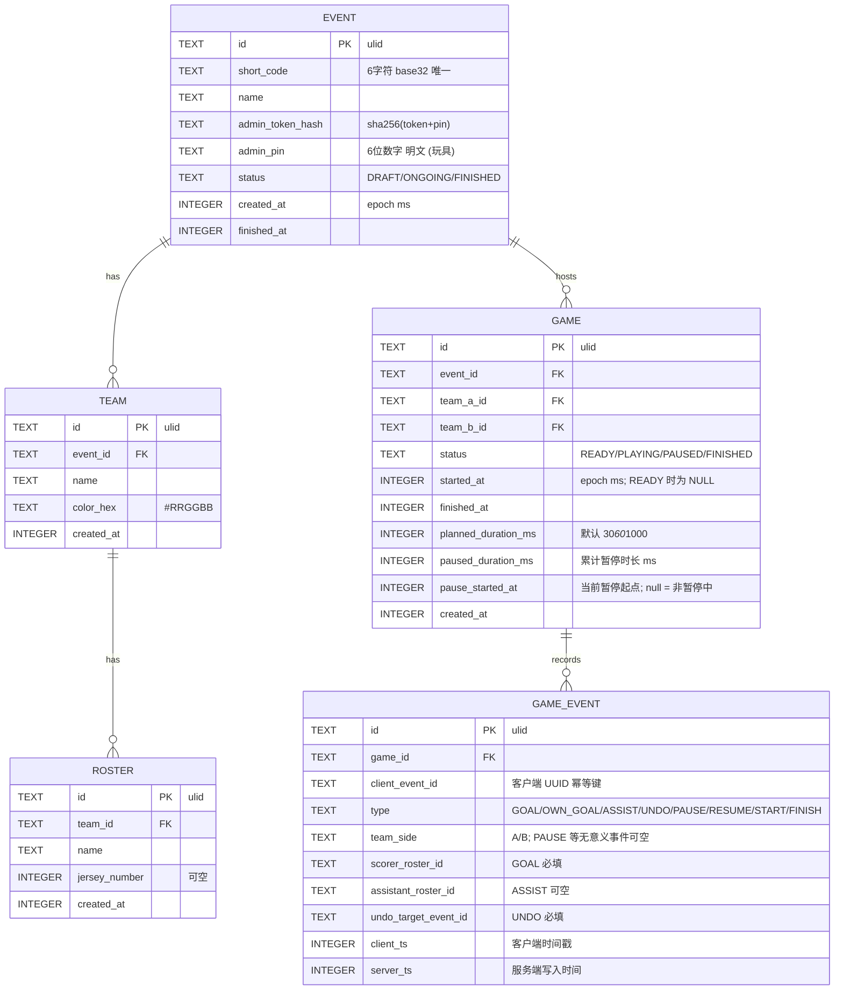

# PitchMaster · 技术架构蓝图

> **状态**：草案 v0.1
> **配套**：[`../DEVELOPMENT_PLAN.md`](../DEVELOPMENT_PLAN.md)（路线 + 阶段） · [`../AGENTS.md`](../AGENTS.md)（AI 上下文）
>
> 本文件是 **技术参考的唯一真源**。DDL、API、算法、目录约定一律在此维护。开发者写代码前先 grep 本文件。

---

## 1. 系统拓扑

```
                ┌─────────────────────────────────────┐
                │     用户设备 (浏览器 PWA)            │
                │  ┌───────────────────────────────┐  │
                │  │ React + Vite + Tailwind       │  │
                │  │ Zustand (UI state)            │  │
                │  │ IndexedDB outbox (离线队列)   │  │
                │  │ EventSource (SSE 订阅)        │  │
                │  └───────────────────────────────┘  │
                └────────────┬────────────────────────┘
                             │ HTTPS
                ┌────────────▼────────────────────────┐
                │ Caddy (auto HTTPS)                   │
                │   reverse_proxy → :3000              │
                └────────────┬────────────────────────┘
                             │
                ┌────────────▼────────────────────────┐
                │  Node 20 + Hono (单进程)             │
                │  ┌────────────────────────────────┐ │
                │  │ Routes  (REST)                 │ │
                │  │ Services (业务)                │ │
                │  │ Drizzle ORM                    │ │
                │  │ SSE Broker (in-memory)         │ │
                │  │ Satori (海报渲染)              │ │
                │  └────────────────────────────────┘ │
                └────────────┬────────────────────────┘
                             │
                ┌────────────▼────────────────────────┐
                │  SQLite 文件 (WAL 模式)              │
                │  /var/lib/pitchmaster/data.db        │
                └─────────────────────────────────────┘
```

**关键约束**：
- 单进程 Node 服务器（不需要集群；玩具场景）
- SQLite 单文件，WAL 模式，备份 = `cp`
- SSE 连接池在 Node 进程内存，进程重启即重连（前端自动）
- 服务端持有"权威时间"（所有 `created_at`、`started_at` 都以 server clock 为准）

---

## 2. 目录结构

```
pitch-master/
├── AGENTS.md                       # AI 上下文（合并后唯一）
├── DEVELOPMENT_PLAN.md             # 路线 + 阶段 + 验收
├── README.md                       # 用户角度的简介与快速上手
├── docs/
│   ├── ARCHITECTURE_V2.md          # 本文件
│   └── DECISIONS.md                # ADR 记录（重大决策变更追加）
├── backend/                        # Node + Hono 后端
│   ├── src/
│   │   ├── app.ts                  # Hono 入口
│   │   ├── routes/
│   │   │   ├── events.ts
│   │   │   ├── teams.ts
│   │   │   ├── games.ts
│   │   │   ├── events-stream.ts    # SSE
│   │   │   └── poster.ts
│   │   ├── services/
│   │   │   ├── event.service.ts
│   │   │   ├── game.service.ts
│   │   │   ├── timer.service.ts
│   │   │   ├── outbox.service.ts
│   │   │   ├── poster.service.ts
│   │   │   └── poster-font.ts      # 运行时 PosterCJK 子集
│   │   ├── poster/                 # satori 模板 + layout + tokens
│   │   ├── db/
│   │   │   ├── schema.ts           # Drizzle schema
│   │   │   ├── client.ts           # better-sqlite3 实例
│   │   │   └── migrations/         # drizzle-kit 生成
│   │   ├── lib/
│   │   │   ├── sse-broker.ts
│   │   │   ├── short-code.ts       # 6 位 base32 生成
│   │   │   └── auth.ts             # adminToken / PIN 校验
│   │   └── assets/
│   │       └── fonts/              # NotoSC + GeistMono + Newsreader woff 子集
│   ├── tests/
│   │   ├── game.service.test.ts
│   │   ├── timer.service.test.ts
│   │   └── outbox.service.test.ts
│   ├── drizzle.config.ts
│   ├── package.json
│   ├── tsconfig.json
│   └── vitest.config.ts
├── web/                            # React + Vite + PWA 前端
│   ├── src/
│   │   ├── main.tsx
│   │   ├── App.tsx                 # react-router 路由表
│   │   ├── lib/
│   │   │   ├── tokens.ts           # 设计令牌（与 poster 同步）
│   │   │   ├── uuid.ts             # randomUUID HTTP/WebView fallback
│   │   │   ├── roster-import.ts    # 微信报名文本解析（S1）
│   │   │   ├── roster-import-store.ts  # sessionStorage 导入池
│   │   │   └── outbox/             # IndexedDB 队列
│   │   ├── components/
│   │   │   ├── ui/                 # 基础 UI 组件
│   │   │   ├── roster/             # RosterImportPanel / TeamImportChips
│   │   │   └── report/             # 战报 H5 layout + Hero
│   │   ├── pages/
│   │   ├── stores/                 # Zustand
│   │   ├── api/                    # 调用后端
│   │   └── sw.ts                   # 自定义 SW（injectManifest）
│   ├── public/fonts/               # 自托管 Geist Mono + Newsreader
│   ├── index.html
│   ├── vite.config.ts
│   └── package.json
└── deploy/
    ├── scripts/
    │   ├── install.sh
    │   ├── upgrade.sh
    │   └── backup.sh
    ├── systemd/
    │   └── pitchmaster-v2.service
    └── caddy/
        └── Caddyfile
```

---

## 3. 数据模型与 DDL

### 3.1 ER 概览



### 3.2 索引

```sql
CREATE UNIQUE INDEX idx_event_short_code ON event(short_code);
CREATE INDEX idx_team_event ON team(event_id);
CREATE INDEX idx_roster_team ON roster(team_id);
CREATE INDEX idx_game_event ON game(event_id);
CREATE INDEX idx_game_event_game ON game_event(game_id, server_ts);
CREATE UNIQUE INDEX idx_game_event_idem ON game_event(game_id, client_event_id);
```

### 3.3 派生数据（不存储，查询时计算）

| 派生项 | 公式 |
|---|---|
| 当前比分 | `count(GOAL where team_side=A and not undone) + count(OWN_GOAL where team_side=B and not undone) - ...` |
| 已用时（ms） | `now - started_at - paused_duration_ms - (pause_started_at ? now - pause_started_at : 0)` |
| 剩余时间 | `planned_duration_ms - 已用时` |
| MVP | 进球+助攻最多的 roster；并列取较早出现者 |
| 赛后修正 | Admin 可对任意有效进球写入 UNDO（不限顺序）；修改 = 撤销原事件 + 写入新进球 |
| 射手榜 | group by scorer_roster_id, count desc |

---

## 4. API 契约

### 4.1 全局规范

- 所有响应统一：`{ ok: true, data: ... }` 或 `{ ok: false, error: { code, message } }`
- HTTP 状态语义化（200/201/400/401/404/409/500）
- 鉴权方式：写接口需要 `Authorization: Bearer <adminToken>` 或 `?pin=<6位PIN>`
- 时间戳：epoch ms (UTC)，前端显示时转本地时区

### 4.2 端点列表（完整）

| Method | Path | 权限 | 描述 |
|---|---|---|---|
| GET | `/api/time` | 公开 | 返回 `{serverNow: 1718712345678}` 用于时钟校准 |
| POST | `/api/events` | 公开 | 创建活动；返回 `{id, shortCode, adminToken, pin}` |
| GET | `/api/events/:shortCode` | 公开 | 获取活动详情（含 teams + games 列表，不含 adminToken） |
| POST | `/api/events/:id/finish` | Admin | 手动结束活动 → `{eventId, finishedAt}`；客户端归档唯一触发源 |
| POST | `/api/events/:id/restore-token?pin=` | 公开（PIN） | PIN 正确时轮换 adminToken → `{restored, adminToken?}` |
| POST | `/api/events/:id/teams` | Admin | 创建队伍 `{name, colorHex?}` |
| PATCH | `/api/teams/:id` | Admin | **未实现**（Phase 2+） |
| DELETE | `/api/teams/:id` | Admin | **未实现**（Phase 2+） |
| POST | `/api/teams/:id/roster` | Admin | 批量加人 `{names: ['张三','李四']}` |
| DELETE | `/api/roster/:id` | Admin | **未实现**（Phase 2+） |
| POST | `/api/events/:id/games` | Admin | 创建场次 `{teamAId, teamBId, plannedDurationMs?}` |
| GET | `/api/games/:id` | 公开 | 详情（含事件流 + 派生比分） |
| POST | `/api/games/:id/start` | Admin | 开赛（写 `started_at = now`） |
| POST | `/api/games/:id/pause` | Admin | 暂停 |
| POST | `/api/games/:id/resume` | Admin | 恢复 |
| POST | `/api/games/:id/finish` | Admin | 结束 |
| POST | `/api/games/:id/events` | Admin | 单条事件（`PLAYING`/`PAUSED`/`FINISHED` 均可，用于赛后补录） |
| POST | `/api/games/:id/events/batch` | Admin | 离线 outbox 批量 replay（按 `clientTs` 排序，幂等） |
| DELETE | `/api/games/:id/events/:eventId` | Admin | 撤销事件（写入 UNDO；`FINISHED` 亦可，用于赛后修正） |
| GET | `/api/games/:id/stream` | 公开 | SSE 订阅 |
| GET | `/api/games/:id/report` | 公开 | 单场战报 JSON |
| GET | `/api/games/:id/poster.png` | 公开 | 单场海报 PNG |
| GET | `/api/events/:id/report` | 公开 | 活动战报 JSON（`:id` 可为 event id 或 shortCode；Top 5 固定） |
| GET | `/api/events/:id/poster.png` | 公开 | 活动海报 PNG 1080×1350（可扩至 1620；60s 内存缓存） |
| GET | `/api/health` | 公开 | 健康检查 `{status, service, version, uptimeSeconds, serverTime}` |
| GET | `/api/healthz` | 公开 | 同上（UptimeRobot 等探活别名，Phase 3 T3.5） |

### 4.3 关键请求/响应样例

**POST /api/events**
```json
// Request
{ "name": "周二夜场" }

// Response 201
{
  "ok": true,
  "data": {
    "id": "01HZ...",
    "shortCode": "A4F9KQ",
    "adminToken": "tok_a1b2c3d4e5...",
    "pin": "823517"
  }
}
```

**POST /api/games/:id/events**
```json
// Request
{
  "clientEventId": "uuid-v4-xxxx",
  "type": "GOAL",
  "teamSide": "A",
  "scorerRosterId": "01HZ...",
  "assistantRosterId": "01HZ...",
  "clientTs": 1718712345678
}

// Response 201
{
  "ok": true,
  "data": {
    "event": { /* 完整 game_event 记录 */ },
    "scoreA": 2,
    "scoreB": 1
  }
}
```

**SSE 帧格式**（`/api/games/:id/stream`）
```
event: game_update
data: {"type":"GOAL","gameEvent":{...},"scoreA":2,"scoreB":1,"elapsedMs":824000}

event: timer_tick
data: {"elapsedMs":830000,"status":"PLAYING"}
```

---

## 5. 鉴权机制（极简版）

### 5.1 设计

- 创建活动时服务端生成两段秘密：
  - `adminToken`：长随机字符串（32 字节 base64url），存 localStorage，写操作使用
  - `adminPin`：6 位数字（明文存 DB），用于"换设备"时拾回（用户手动输入）
- DB 存 `admin_token_hash = sha256(adminToken + pin)`（不可逆，但 pin 在 DB 明文用于换设备校验）
- 写接口校验顺序：
  1. 优先校验 `Authorization: Bearer <token>` → 用 `sha256(token + db.pin)` 比对 `admin_token_hash`
  2. 退化校验 `?pin=XXXXXX` → 直接比对 `db.admin_pin`，校验通过后返回新的 `adminToken` 给前端存

### 5.2 安全说明

> ⚠️ 这是"玩具级"安全设计。明文 PIN 入库、无限速、无审计。仅适用于 §决策 D3 的小圈子场景。任何"对外开放注册"的想法都需要先重做这一节。

---

## 6. 离线同步机制

### 6.1 客户端 outbox

IndexedDB store `outbox`：
```ts
interface OutboxItem {
  id: string;              // uuid v4（outbox 行主键）
  gameId: string;
  eventId: string;         // 父活动 id，flush 时解析 adminToken
  payload: {
    clientEventId: string;
    type: 'GOAL' | 'UNDO';
    teamSide?: 'A' | 'B';
    scorerRosterId?: string;
    assistantRosterId?: string;
    undoTargetEventId?: string;
    undoTargetClientEventId?: string;
  };
  clientTs: number;        // 写入时的客户端 ms（已含 server offset）
  status: 'PENDING' | 'SENDING' | 'FAILED';
  retryCount: number;
  lastError?: string;
}
```

### 6.2 写流程

```
用户点击 GOAL
  ↓
1. UI optimistically 更新（Zustand store 立即 +1）
  ↓
2. 写入 IndexedDB outbox (status=PENDING)
  ↓
3. 立即触发 worker.flush()（非阻塞）
  ↓
worker.flush():
  - 取所有 PENDING 项，按 clientTs 升序
  - 同一 gameId 的项打包 POST /api/games/:id/events/batch
  - 成功 → 删除 outbox 条目
  - 失败 → status=FAILED, retryCount++（指数退避，最多 5 次）
```

### 6.3 服务端幂等

- 每条事件携带 `clientEventId`（UUID）
- DB 唯一约束 `(game_id, client_event_id)`
- 重复提交 → 服务端检测后返回 200 + 现有记录（视为成功）

### 6.4 冲突说明（v2 假设）

**v2 假设**：同一场比赛**只有一个管理员设备**在录入。其他设备只读。
- 该假设让我们彻底避开 CRDT / OT 的复杂度
- 如果未来 v3 需要多人协同录入，再引入 yjs 或类似方案

### 6.5 时钟纠偏

- 录入时 `clientTs = Date.now() + clientServerOffsetMs`
- `clientServerOffsetMs` 由 `GET /api/time` 校准，每 5 分钟自动重新校准
- 这避免了用户手机时间错乱导致事件顺序混乱

---

## 7. 战报渲染

> 战报与 §8 的 UI 设计令牌**同源**——海报由 satori 渲染 React 组件，组件直接消费 Tailwind 等价的样式表达，确保"分享图 / 在线 H5 / App 内页面"三处视觉完全一致。任何对 §8 设计令牌的修改自动传导到战报。

### 7.1 战报两层

| 层级 | 触发 | 内容 |
|---|---|---|
| **单场战报** | 一场比赛 `FINISHED` 后 | 比分 + 计时 + 进球流水（分队伍）+ 单场 MVP（=进球+助攻最多者，并列取较早出现） |
| **活动战报** | 活动 finish 或 admin 随时分享 | 场次结果列表 + 积分榜 + 射手榜（Top N）+ 助攻榜（Top N）+ 活动 MVP（=活动内总进球+总助攻最多者） |

两层战报均提供：
- H5 只读页面（路由：`/events/:shortCode/report`、`/games/:id/report`）
- PNG 海报（API：`/api/events/:id/poster.png`、`/api/games/:id/poster.png`）

射手榜 / 助攻榜固定 **Top 5**（`REPORT_TOP_N = 5`，见 `report.service.ts`）。2026-06 UI 升级后已移除 `?topN=` query 与前端选择器，响应 `meta.topN` 恒为 5。

### 7.2 数据派生算法

**积分榜（standings）** — 标准足球规则：

```ts
const POINTS = { win: 3, draw: 1, loss: 0 }

interface TeamStanding {
  teamId: string; teamName: string; colorHex: string;
  played: number; wins: number; draws: number; losses: number;
  goalsFor: number; goalsAgainst: number; goalDiff: number;
  points: number; rank: number;
}

function computeStandings(event): TeamStanding[] {
  const acc = new Map<teamId, TeamStanding>()
  // 初始化每个队伍
  for (team of event.teams) acc.set(team.id, { ...zeroStat, teamId: team.id, ... })

  // 仅统计已结束的场次
  for (game of event.games.filter(g => g.status === 'FINISHED')) {
    const { scoreA, scoreB } = deriveScore(game.events)
    const a = acc.get(game.teamAId)!, b = acc.get(game.teamBId)!
    a.played++; b.played++
    a.goalsFor += scoreA; a.goalsAgainst += scoreB
    b.goalsFor += scoreB; b.goalsAgainst += scoreA
    if (scoreA > scoreB)      { a.wins++;  b.losses++ }
    else if (scoreA < scoreB) { b.wins++;  a.losses++ }
    else                      { a.draws++; b.draws++  }
  }

  // 计算积分与净胜球
  for (s of acc.values()) {
    s.points = s.wins * POINTS.win + s.draws * POINTS.draw
    s.goalDiff = s.goalsFor - s.goalsAgainst
  }

  // 排序：积分 desc → 净胜球 desc → 进球数 desc → 队名 asc
  const sorted = [...acc.values()].sort((x, y) =>
    y.points - x.points
    || y.goalDiff - x.goalDiff
    || y.goalsFor - x.goalsFor
    || x.teamName.localeCompare(y.teamName, 'zh-Hans')
  )
  sorted.forEach((s, i) => s.rank = i + 1)
  return sorted
}
```

**射手榜（top scorers）**：
- 统计所有 `FINISHED` 场次中、未被 `UNDO` 的 `GOAL` 事件
- 按 `scorer_roster_id` group by，count desc
- 同分按"首次进球时间"升序（先进者靠前）
- 关联 `roster.name` + `team.name` + `team.color_hex`
- 截断至 `REPORT_TOP_N`（5）

**助攻榜（top assists）**：
- 统计所有 `FINISHED` 场次中、未被 `UNDO` 且 `assistant_roster_id` 非空的事件
- 其余同射手榜

**活动 MVP**：
- 每个 roster 计算 `goals + assists` 总分
- 取最高者；并列时优先取首次进球时间更早者

> ⚠️ 排序稳定性约束：同一份事件流多次渲染必须得到相同排序，禁止用 `Map` 迭代顺序作为隐含排序键。

### 7.3 数据契约（API 返回）

**`GET /api/events/:id/report`**
```ts
interface EventReport {
  event: { id, shortCode, name, createdAt, finishedAt? }
  games: Array<{
    id, teamA: TeamBrief, teamB: TeamBrief,
    scoreA, scoreB, status, durationMs
  }>
  standings: TeamStanding[]               // §7.2 输出
  topScorers: Array<{
    rosterId, name, teamId, teamName, colorHex,
    goals: number, firstGoalAt: number    // epoch ms，用于排序
  }>
  topAssists: Array<{
    rosterId, name, teamId, teamName, colorHex,
    assists: number, firstAssistAt: number
  }>
  mvp?: { rosterId, name, teamName, colorHex, goals, assists }
  meta: { topN: number, generatedAt: number }
}
```

**`GET /api/games/:id/report`**
```ts
interface GameReport {
  game: { id, eventId, teamA, teamB, scoreA, scoreB,
          startedAt, finishedAt, durationMs, status }
  goals: Array<{                         // 按时间升序
    minute: number,                      // 相对开赛多少分钟
    teamSide: 'A' | 'B',
    scorerName: string,
    assistantName?: string,
    type: 'GOAL' | 'OWN_GOAL'
  }>
  gameMvp?: { rosterId, name, teamName, colorHex, goals, assists }
}
```

### 7.4 渲染管线（服务端 satori）

```ts
// backend/src/services/poster.service.ts
import satori from 'satori'
import { Resvg } from '@resvg/resvg-js'
import { loadPosterFonts } from './poster-font.js'   // 静态 + 运行时 PosterCJK 子集

export async function renderEventPoster(eventId: string): Promise<Buffer> {
  const data = await reportService.buildEvent(eventId)  // REPORT_TOP_N = 5
  const height = estimateEventPosterHeight(data)        // 1350 或 1620（固定契约）

  const svg = await satori(<EventPosterTemplate {...data} />, {
    width: 1080,
    height,
    fonts: await loadPosterFonts(data),  // NotoSC + GeistMono + Newsreader + PosterCJK
  })
  return new Resvg(svg, { background: '#ffffff' }).render().asPng()
}

export async function renderGamePoster(gameId: string): Promise<Buffer> {
  const data = await reportService.buildGame(gameId)
  const svg = await satori(<GamePosterTemplate {...data} />, {
    width: 1080,
    height: 1350,
    fonts: await loadPosterFonts(data),
  })
  return new Resvg(svg, { background: '#ffffff' }).render().asPng()
}
```

字体（`backend/scripts/prepare-fonts.mjs` + `poster-font.ts`）：
- **静态子集**（构建时）：NotoSC Regular/Bold + Geist Mono + Newsreader Italic，合计约 ~72KB woff
- **PosterCJK**：渲染时按本场/本次活动出现的 CJK 字形动态子集，family 名 `PosterCJK`（fallback 到 NotoSC）
- 文件位置：`backend/src/assets/fonts/`（build 复制到 `dist/assets/fonts/`）

### 7.5 模板：活动战报（EventPosterTemplate）

风格 **Notion-体育 minimalist · 4:5 编辑级版面**（2026-06 UI 升级锁定）。画布 **1080×1350**（内容过多时固定扩至 **1620**，由 `estimateEventPosterHeight()` 契约）。

版面（自上而下，**hairline-only、无 emoji、无静态阴影**）：

```
┌──────────────────────────────────────┐
│  eyebrow: PitchMaster · {shortCode}   │
│  {event.name}                         │
│  {date}                               │
├──────────────────────────────────────┤  ← hairline #EAEAEA
│  场次 pills（横滚摘要）                │
├──────────────────────────────────────┤
│  积分榜（tabular，队色条）             │
├──────────────────────────────────────┤
│  射手 Top 5 · 助攻 Top 5（双栏）       │
├──────────────────────────────────────┤
│  MVP · Newsreader Italic verdict      │
└──────────────────────────────────────┘
```

**视觉规则**（与 §8.3 设计令牌严格对应）：
- 背景 `surface`（#FFFFFF）；区块分隔仅用 1px `border`（#EAEAEA）
- 比分 / 统计数字：`Geist Mono` + `tabular-nums`
- 活动 MVP 一句评价：`Newsreader Italic`
- 中文正文 / 队名：`PosterCJK` → fallback `NotoSC`
- 队色条：`team.colorHex`（预置 8 色，见 §8.3.1）
- 名次：前 3 `primary` 绿圆点，4+ 灰字

### 7.6 模板：单场战报（GamePosterTemplate）

固定 **1080×1350**，单页版面：

```
┌──────────────────────────────────────┐
│  PitchMaster · 第 {n} 场              │
│  {event.name}                         │
├──────────────────────────────────────┤
│         3  —  2                       │  ← Geist Mono 240px Hero
│    ▮红队          ▮蓝队               │
│         50:00 · 已结束                │
├──────────────────────────────────────┤
│  进球流水（按队分组，分钟 + 助攻）      │
├──────────────────────────────────────┤
│  本场 MVP · Newsreader Italic         │
└──────────────────────────────────────┘
```

视觉规则同 §7.5；进球时间 = `(goal.serverTs - game.startedAt - 暂停期内)` / 60000，向下取整为分钟。

### 7.7 H5 战报页面

H5 与海报**同源令牌**（`web/src/lib/tokens.ts`），布局在 `web/src/components/report/`：

| 模块 | 文件 | 说明 |
|---|---|---|
| 布局原语 | `layout.tsx` | `ReportSection`、`Hairline`、`ReportTable` 等 hairline 容器 |
| Hero | `ReportHero.tsx` | 大比分 + verdict 衬线句 |
| 活动战报 | `EventReportView.tsx` | Hero → 积分榜 bento → 射手/助攻 zigzag → 场次横滚 pills |
| 单场战报 | `GameReportView.tsx` | Hero → 进球流水 → MVP |
| 分享 | `PosterPreview.tsx` | 顶部 CTA + 点击海报触发 Web Share |

图标使用 `@phosphor-icons/react`（已移除 emoji）。

**关键加成（§p6 决策）**：H5 头部固定 CTA：`"想下次也来踢吗？→ 进活动主页"`，链接到 `/events/:shortCode`。

---

## 7A. 海报渲染兜底策略

| 风险 | 缓解 |
|---|---|
| satori 不支持某些 CSS 特性（grid、transform 等） | 在 `PosterTemplate` 组件内严格使用 satori 支持的子集（flex、border、border-radius、shadow 简化版）；本地单测 `assets/snapshots/` 比对 PNG |
| 字体文件过大拖累构建 | 子集化到 ≤250KB 单字重；CI 检查字体文件大小 |
| 长图高度估算偏差导致内容被裁切 | 活动海报高度固定为 1350 或 1620（`estimateEventPosterHeight` 单测契约）；不再用动态长图 |
| 海报渲染响应慢 | 后端缓存：activity-level 海报按 `v2:{eventId}:5:{lastEventTs}` 内存缓存 60s |

---

## 8. 前端关键模块

> **PWA（C4 已决 2026-06-19）**：Phase 1 = manifest + SW 注册；Phase 2 T2.1 = `injectManifest` 自定义 SW（App Shell 预缓存、`/api/*` NetworkOnly、`offline.html` 兜底）、Background Sync 标签 `outbox-flush` 与客户端 flush 联动、`/api/health` 主动探测 + 顶栏离线/待同步状态。

### 8.1 状态管理（Zustand）

- `useEventStore`：当前活动元数据
- `useGameStore`：当前场次状态 + 事件流（optimistic）
- `useTimerStore`：派生计时（由 game.started_at + clientServerOffset 计算）
- `useOutboxStore`：未同步项数 + flush trigger
- `useNetworkStore`：在线状态（navigator.onLine + 主动探测）

### 8.2 路由

```
/                                          首页（新建 / 加入 / 找回 / 进行中 / 已归档）
/events/new                                创建活动（4 步：含 PIN 凭证确认）
/events/:shortCode                         活动主页（adminToken 管理 + 手动结束活动）
/events/:shortCode/setup                   配置队伍与队员（仅 adminToken）
/events/:shortCode/report                  战报 H5
/games/:id/report                          单场战报 H5
/games/new?eventId=...                     新建场次（仅 adminToken）
/games/:id/record                          录入页（仅 adminToken）
/games/:id                                 场次只读详情（SSE 实时）
/admin/restore?code=                       凭 PIN 找回 adminToken（分享码可预填）
```

### 8.3 UI 设计系统（与战报严格同源）

> 本节定义 **唯一一套** 视觉令牌，App 页面、H5 战报、PNG 海报三处都消费它。任何变更必须三处同步。

#### 8.3.1 色板

源文件：`web/src/lib/tokens.ts`（后端镜像 `backend/src/poster/tokens.ts` + `tailwind.config.ts` extend）

```js
// web/tailwind.config.ts → theme.extend.colors
{
  primary:    '#2E7D5B',   // 球场墨绿（主操作 / 前 3 名次 / 胜利）
  primaryDk:  '#1E5A3F',
  primaryPale:'#EDF3EC',
  danger:     '#9F2F2D',   // 撤销、负标签
  warning:    '#9F7B26',   // 暂停状态
  surface:    '#FFFFFF',   // 主背景（暖白）
  elevated:   '#FBFBFA',   // 次级区块底
  border:     '#EAEAEA',   // hairline 分隔（取代 Card 阴影）
  textPri:    '#1F2328',
  textSec:    '#6B6B6B',
  textInv:    '#FFFFFF',
  chipBg:     '#F4F2EE',   // 可选行底（战报表格）
}
```

> 队伍颜色 `team.color_hex` 由用户在配置队伍时选；预置 8 色见 `tokens.ts` → `teamPalette`（brick / amber / ochre / sage / teal / cobalt / plum / rose）。

#### 8.3.2 字号 / 字重

```js
fontSize: {
  'tap':    ['1.75rem', { lineHeight: '2.25rem', fontWeight: '700' }],
  'score':  ['4rem',    { lineHeight: '1',       fontWeight: '600' }],  // 录入页 Hero；海报 240px mono
  'h1':     ['1.875rem', { lineHeight: '2.25rem', fontWeight: '700' }],
  'h2':     ['1.25rem',  { lineHeight: '1.75rem', fontWeight: '700' }],
  'body':   ['1rem',     { lineHeight: '1.5rem',  fontWeight: '400' }],
  'caption':['0.75rem',  { lineHeight: '1rem',    fontWeight: '400' }],
},
fontFamily: {
  sans:  ['ui-sans-serif', 'system-ui', '"PingFang SC"', '"Microsoft YaHei"', 'sans-serif'],
  mono:  ['"Geist Mono"', 'ui-monospace', 'monospace'],           // 比分 / 统计
  serif: ['Newsreader', 'ui-serif', 'Georgia', 'serif'],           // Hero verdict
},
```

自托管字体：`web/public/fonts/` + `web/src/index.css` `@font-face`（Geist Mono、Newsreader Italic 子集）。

#### 8.3.3 间距 / 圆角 / 阴影

| Token | 值 | 用途 |
|---|---|---|
| `space-card-gap` | 16px (`gap-4`) | 区块之间 |
| `space-card-padding` | 24px (`p-6`) | 区块内边距 |
| `space-row-gap` | 8px (`gap-2`) | 行内元素间距 |
| `radius-card` | 12px (`rounded-xl`) | 可点击卡片 / pill 按钮 |
| `radius-pill` | 9999px (`rounded-full`) | 主 CTA、状态 chip |
| `shadow` | 静态 `none`；hover `0 2px 8px rgba(0,0,0,.04)` | 仅交互态，战报/海报无阴影 |

#### 8.3.4 组件清单

| 组件 | 路径 | 用途 |
|---|---|---|
| `Card` / `Section` / `TeamBadge` / `RankBadge` / `StatusChip` / `StatRow` / `ScoreBoard` | `web/src/components/ui/` | App 通用 |
| `ReportSection` / `ReportHero` / `Hairline` 等 | `web/src/components/report/` | H5 战报专用 layout |
| `PosterRow` / `PosterHero` 等 | `backend/src/poster/layout.tsx` | satori 海报（inline style，令牌同源） |

> App / H5 消费 Tailwind class；海报消费 `tokens.ts` 数值 + satori inline style。**不允许 hardcode 颜色**。

#### 8.3.5 交互硬性规范

- 任何可点击元素最小命中区 ≥ 56×56px（拇指可达性）
- 主操作按钮（GOAL）一律 ≥ 屏宽 80% × 高度 25vh
- 所有数字（比分、积分、统计）必须 `tabular-nums` + `font-mono`（Geist Mono）
- **hairline-first**：列表/战报优先用 `#EAEAEA` 分隔，不用 Card 阴影堆叠
- 图标：`@phosphor-icons/react`；**禁止 emoji**（海报 / H5 / App 一致）
- 浅色优先；深色模式若做须同步维护海报背景

### 8.4 微信报名导入（S1 · 2026-06-19）

| 模块 | 文件 | 说明 |
|---|---|---|
| 解析 | `web/src/lib/roster-import.ts` | `parseWechatSignupText`：每行序号后全文即球员名；跳过 meta 行 |
| 会话池 | `web/src/lib/roster-import-store.ts` | `sessionStorage` 按 `eventId`；结束活动清空 |
| 粘贴 UI | `web/src/components/roster/RosterImportPanel.tsx` | 解析预览 + 待分配名单 |
| 分队 chip | `web/src/components/roster/TeamImportChips.tsx` | 多选 → `POST /api/teams/:id/roster` |

生命周期：活动 `FINISHED` 或管理员手动结束活动时调用 `clearRosterImportPool`。

### 8.5 新建场次选队

`web/src/lib/new-game-teams.ts`：`teamOptionsForSide` / `resolveOtherTeamId` / `canCreateGame`——防止 A/B 选同一队。

后端默认场次时长：`backend/src/lib/game-defaults.ts` → `DEFAULT_PLANNED_DURATION_MS`（15 分钟），`createGame` 未传 `plannedDurationMs` 时使用。

---

## 9. 后端关键模块

### 9.1 Service 切分

- `event.service.ts`：建活动、生成 shortCode/pin、查询
- `game.service.ts`：建场、写事件、计算比分（核心）
- `timer.service.ts`：start/pause/resume/finish + 派生 elapsed
- `outbox.service.ts`：批量幂等写入
- `poster.service.ts`：satori 渲染
- `auth.service.ts`：token/pin 校验

### 9.2 比分派生算法（核心）

```ts
function deriveScore(events: GameEvent[]): {scoreA:number, scoreB:number} {
  // 1. 找出所有被 UNDO 的事件 id
  const undone = new Set(events.filter(e=>e.type==='UNDO').map(e=>e.undoTargetEventId))
  let a=0, b=0
  for (const e of events) {
    if (undone.has(e.id)) continue
    if (e.type==='GOAL') { e.teamSide==='A' ? a++ : b++ }
    if (e.type==='OWN_GOAL') { e.teamSide==='A' ? b++ : a++ }
  }
  return {scoreA:a, scoreB:b}
}
```

### 9.3 SSE Broker

```ts
// in-memory map: gameId → Set<emitter>
const channels = new Map<string, Set<(data:any)=>void>>()

export function subscribe(gameId: string, emit: (d:any)=>void): ()=>void {
  if (!channels.has(gameId)) channels.set(gameId, new Set())
  channels.get(gameId)!.add(emit)
  return () => channels.get(gameId)!.delete(emit)
}

export function broadcast(gameId: string, data: any) {
  channels.get(gameId)?.forEach(emit => emit(data))
}
```

### 9.4 短码生成

- 字母表：`0123456789ABCDEFGHJKMNPQRSTVWXYZ`（去掉易混 I/L/O/U）
- 长度 6 → 32^6 ≈ 10 亿，玩具场景永不冲突
- 创建时 retry on unique violation

---

## 10. 部署架构

### 10.1 服务器最小要求

- 1C / 1G / 20GB SSD（玩具场景充分）
- Ubuntu 22.04 / Alibaba Cloud Linux 3
- 端口：80 / 443

### 10.2 install.sh 关键步骤

```bash
# 1. 装 Node 20
curl -fsSL https://deb.nodesource.com/setup_20.x | bash -
apt-get install -y nodejs

# 2. 装 Caddy
apt install -y debian-keyring debian-archive-keyring apt-transport-https
curl -1sLf 'https://dl.cloudsmith.io/public/caddy/stable/gpg.key' | gpg --dearmor -o /usr/share/keyrings/caddy-stable-archive-keyring.gpg
... (官方步骤略)
apt install caddy

# 3. 部署应用
mkdir -p /opt/pitchmaster-v2
git clone <repo> /opt/pitchmaster-v2
cd /opt/pitchmaster-v2
cd backend && npm ci && npm run build
cd ../web && npm ci && npm run build

# 4. 数据目录
mkdir -p /var/lib/pitchmaster
chown nodeuser:nodeuser /var/lib/pitchmaster

# 5. systemd
cp deploy/systemd/pitchmaster-v2.service /etc/systemd/system/
systemctl enable --now pitchmaster-v2

# 6. Caddy
cp deploy/caddy/Caddyfile /etc/caddy/Caddyfile
systemctl reload caddy
```

### 10.3 Caddyfile

```
{$DOMAIN_OR_IP} {
    root * /opt/pitchmaster-v2/web/dist
    encode gzip
    handle /api/* {
        reverse_proxy localhost:3000
    }
    handle {
        try_files {path} /index.html
        file_server
    }
}
```

### 10.4 备份

生产脚本：`deploy/scripts/backup.sh`（`sqlite3 .backup`，保留 30 天）。  
`install.sh` 会注册 `/etc/cron.daily/pitchmaster-backup`。

```bash
sudo bash /opt/pitchmaster-v2/bin/backup.sh
# 恢复演练：停服务 → cp 备份覆盖 data.db → 启动
sudo systemctl stop pitchmaster-v2
cp /var/lib/pitchmaster/backups/data-YYYYMMDD.db /var/lib/pitchmaster/data.db
sudo systemctl start pitchmaster-v2
```

---

## 11. 测试策略

### 11.1 后端

- **框架**：vitest + better-sqlite3 in-memory
- **必测覆盖**（≥60% 行覆盖 + 100% 关键路径）：
  - `game.service.deriveScore()` 所有事件组合
  - `timer.service` start/pause/resume/finish 边界
  - `outbox.service` 幂等性（同 clientEventId 提交两次）
  - `event.service` shortCode 唯一性
  - `auth.service` token + pin 双路径

### 11.2 前端

- 不做强制单测
- Phase 2 末期手动跑一遍"飞行模式 → 录入 → 恢复网络"剧本，截图存档

---

## 12. 版本与变更日志

每次 schema 或 API 不兼容变更，在此追加一条：

| 日期 | 变更 | 兼容性 | 迁移说明 |
|---|---|---|---|
| 2026-MM-DD | 初版 schema | - | 全新项目，无历史数据迁移 |
