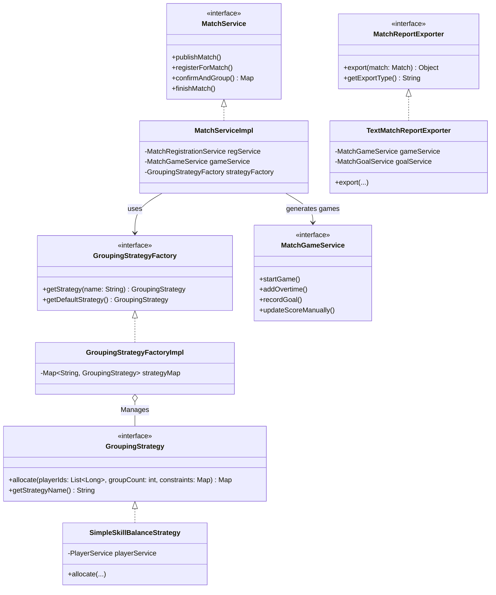

# 类图设计 (Class Diagram)

本系统严格遵守依赖倒置原则。控制层不直接调用实现类，算法层采用工厂模式进行管理。

```mermaid
classDiagram
    %% 核心策略模式设计
    class GroupingStrategy {
        <<interface>>
        +allocate(playerIds: List~Long~, groupCount: int, constraints: Map) Map
        +getStrategyName() String
    }
    
    class SimpleSkillBalanceStrategy {
        -PlayerService playerService
        +allocate(...)
    }
    GroupingStrategy <|.. SimpleSkillBalanceStrategy
    
    class GroupingStrategyFactory {
        <<interface>>
        +getStrategy(name: String) GroupingStrategy
        +getDefaultStrategy() GroupingStrategy
    }
    class GroupingStrategyFactoryImpl {
        -Map~String, GroupingStrategy~ strategyMap
    }
    GroupingStrategyFactory <|.. GroupingStrategyFactoryImpl
    GroupingStrategyFactoryImpl o-- GroupingStrategy : Manages

    %% 赛事与场次管理服务
    class MatchService {
        <<interface>>
        +publishMatch()
        +registerForMatch()
        +confirmAndGroup() Map
        +finishMatch()
    }
    
    class MatchGameService {
        <<interface>>
        +startGame()
        +addOvertime()
        +recordGoal()
        +updateScoreManually()
    }
    
    class MatchServiceImpl {
        -MatchRegistrationService regService
        -MatchGameService gameService
        -GroupingStrategyFactory strategyFactory
    }
    MatchService <|.. MatchServiceImpl
    MatchServiceImpl --> GroupingStrategyFactory : uses
    MatchServiceImpl --> MatchGameService : generates games

    %% 报表导出系统 (策略模式)
    class MatchReportExporter {
        <<interface>>
        +export(match: Match) Object
        +getExportType() String
    }
    class TextMatchReportExporter {
        -MatchGameService gameService
        -MatchGoalService goalService
        +export(...)
    }
    MatchReportExporter <|.. TextMatchReportExporter
```
