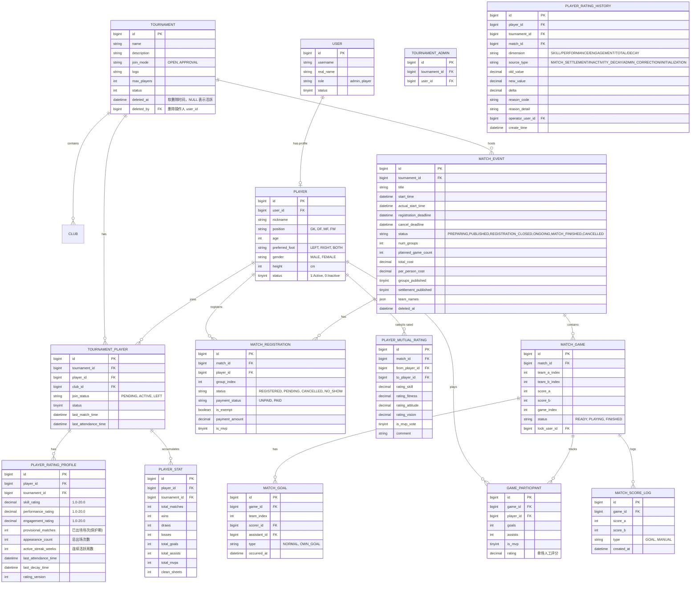

# PitchMaster 数据模型与领域结构

本系统采用关系型数据库 (MySQL) 进行数据持久化，通过 Flyway 进行版本管理（当前最新：V19）。

---

## 1. 领域层次结构

```
Platform（平台）
└── Tournament（赛事，顶层租户隔离单元）
    ├── Club（俱乐部，Tournament 内的组织单元）
    ├── TournamentPlayer（球员在本 Tournament 的身份与时间信息）
    ├── Match（赛事活动）
    │   ├── MatchRegistration（球员报名）
    │   ├── MatchGame（单场比赛）
    │   │   ├── GameParticipant（单场数据：进球/助攻/MVP）
    │   │   └── MatchGoal（进球记录）
    │   └── MatchScoreLog（比分变动审计）
    ├── PlayerRatingProfile（三维评分档案，按 Tournament 隔离）
    ├── PlayerStat（战绩统计，按 Tournament 隔离）
    └── PlayerRatingHistory（评分变动审计，按 Tournament 隔离）

Player（全局球员档案，不绑定 Tournament）
└── PlayerMutualRating（赛后互评，记录荣誉与 MVP 投票）
```

**球员数据分层设计：**

| 层级 | 表 | 说明 |
|------|-----|------|
| 全局档案 | `player` | 昵称、位置、身高等不变属性 |
| Tournament 身份 | `tournament_player` | 加入状态、时间记录 |
| Tournament 评分 | `player_rating_profile` | 三维评分 + 总分（计算值，不存储） |
| Tournament 战绩 | `player_stat` | 胜平负、进球、助攻、MVP 数 |
| 审计 | `player_rating_history` | 每次评分维度变动的完整记录 |

**角色体系：**

| 角色 | 职责 |
|------|------|
| `platform_admin` | 管理全局平台，创建/管理 Tournament |
| `admin`（Tournament Admin） | 管理指定 Tournament 内的比赛、球员、评分 |
| `player` | 报名参赛、提交互评 |

---

## 2. 实体关系图



---

## 3. 关键设计说明

- **多租户隔离**：`tournament_id` 是核心隔离键。`player_rating_profile`、`player_stat`、`player_rating_history` 均按 `(player_id, tournament_id)` 唯一隔离。
- **总评分不存储**：总评 = Skill × 0.4 + Performance × 0.4 + Engagement × 0.2，在查询时实时计算。
- **`player` 表职责**：仅存储全局不变属性（昵称、身高等），与 Tournament 无关。Tournament 内身份由 `tournament_player` 管理。
- **互评定位**：`player_mutual_rating` 记录赛后荣誉投票，不直接驱动 CPI 三维评分。
- **费用分摊**：`cancel_deadline` 后取消报名视为 `NO_SHOW`，`is_exempt=true` 豁免分摊，剩余费用向上取整平摊。
- **比分审计**：`match_score_log` 记录每次比分变动，触发 SSE 推送。
- **软删除**：`match` 表和 `tournament` 表均通过 `deleted_at` + `deleted_by` 实现软删除；列表查询自动过滤 `deleted_at IS NOT NULL` 的记录。
- **Tournament 物理删除**：物理删除 Tournament 时，级联删除所有关联数据（`tournament_admin`、`club`、`tournament_player`、`match`（及其 games/goals/participants/score_logs）、`player_mutual_rating`、`player_stat`、`player_rating_profile`、`player_rating_history`）；仅允许对已软删除的 Tournament 执行物理删除。
