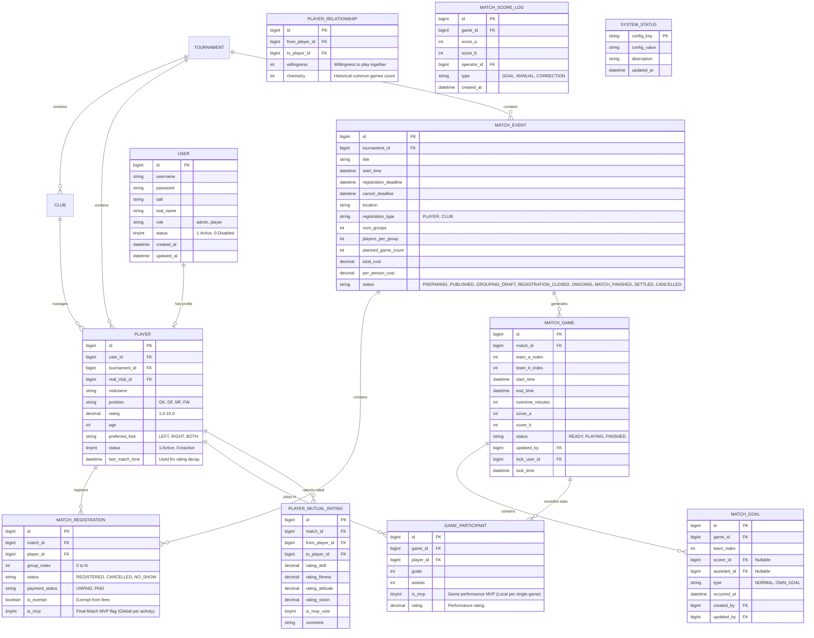

# 数据模型 (Data Model)

本系统采用关系型数据库 (MySQL) 进行数据持久化，通过 Flyway 进行版本管理。

## 1. 实体关系图 (ER Diagram)

## 2. 关键设计说明
* **多租户体系**：
    - `TOURNAMENT` (赛事)：最高级隔离，如“老男孩俱乐部公开赛”。
    - `CLUB` (俱乐部)：逻辑组织层，属于某个 `TOURNAMENT`。
* **状态机流转**：
    - `MATCH_EVENT`：`PREPARING` -> `PUBLISHED` (开放报名) -> `REGISTRATION_CLOSED` -> `ONGOING` -> `MATCH_FINISHED` -> `SETTLED` (费用结算)。
* **费用分摊与豁免**：
    - `is_exempt`：标记特定人员（如特殊嘉宾或伤退者）不参与分摊。
    - `NO_SHOW`：报名后未准时参加且未提前取消，需参与费用平摊。
* **数据审计与锁定**：
    - `MATCH_SCORE_LOG`：专门用于追踪单场比赛比分的每一次跳动，记录操作轨迹。
    - `lock_user_id`：管理员在编辑场次数据时会进行乐观锁定，防止并发修改。
* **球员成长与衰减**：
    - `last_match_time`：用于追踪球员活跃度，配合 `SYSTEM_STATUS` 中的 `LAST_DECAY_RUN_TIME` 执行评分衰减逻辑。
    - `PLAYER_MUTUAL_RATING`：提供多维度的球员反馈，作为动态评分策略的输入。
