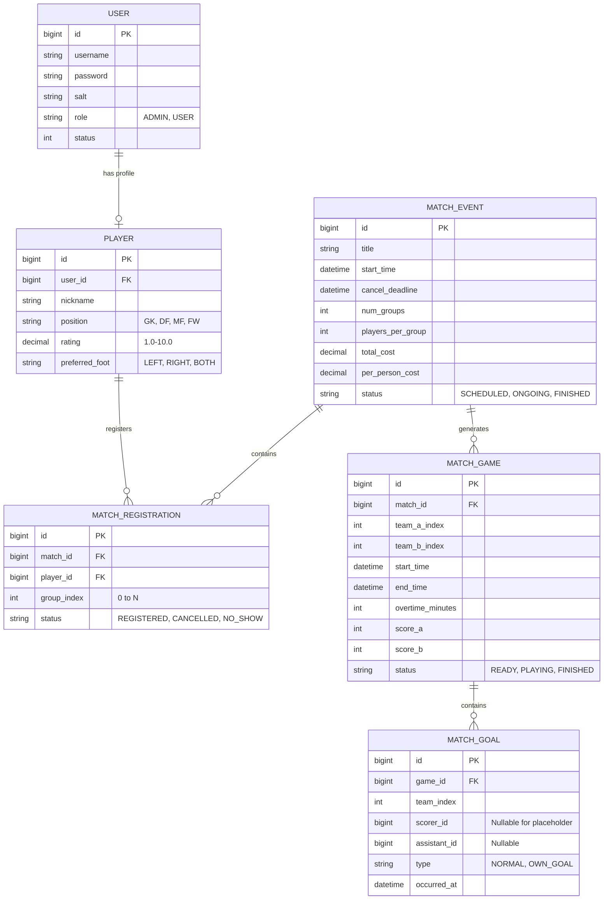

# 数据模型 (Data Model)

本系统采用关系型数据库 (MySQL) 进行数据持久化，通过 Flyway 进行版本管理。

## 1. 实体关系图 (ER Diagram)

## 2. 关键设计说明
* **逻辑分离**：`MATCH_EVENT` 代表一次“活动”（如周六约战），`MATCH_GAME` 代表活动中的“具体场次”（如 A队 vs B队）。
* **费用分摊**：`MATCH_REGISTRATION.status` 为 `NO_SHOW` 时，表示该球员超过了 `cancel_deadline` 取消，不参与分组但**参与费用分摊**。
* **比分占位**：当管理员手动修改 `MATCH_GAME` 的比分且大于实际记录的 `MATCH_GOAL` 时，系统会自动生成 `scorer_id` 为空的 `MATCH_GOAL` 记录作为占位。
