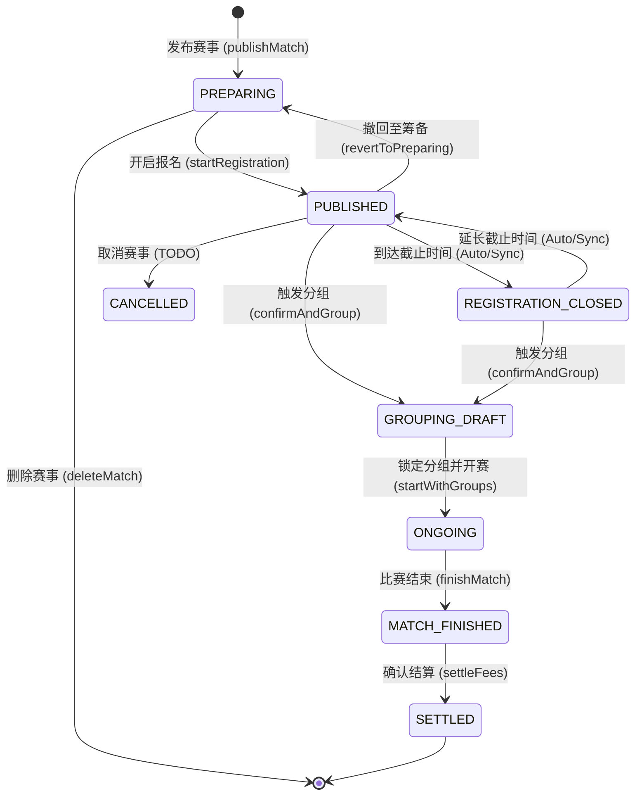
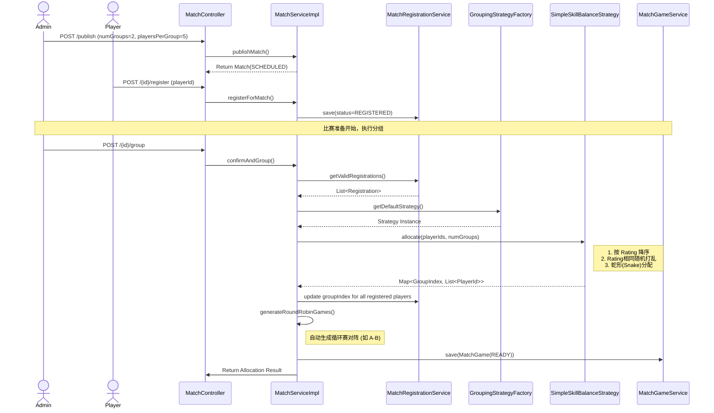
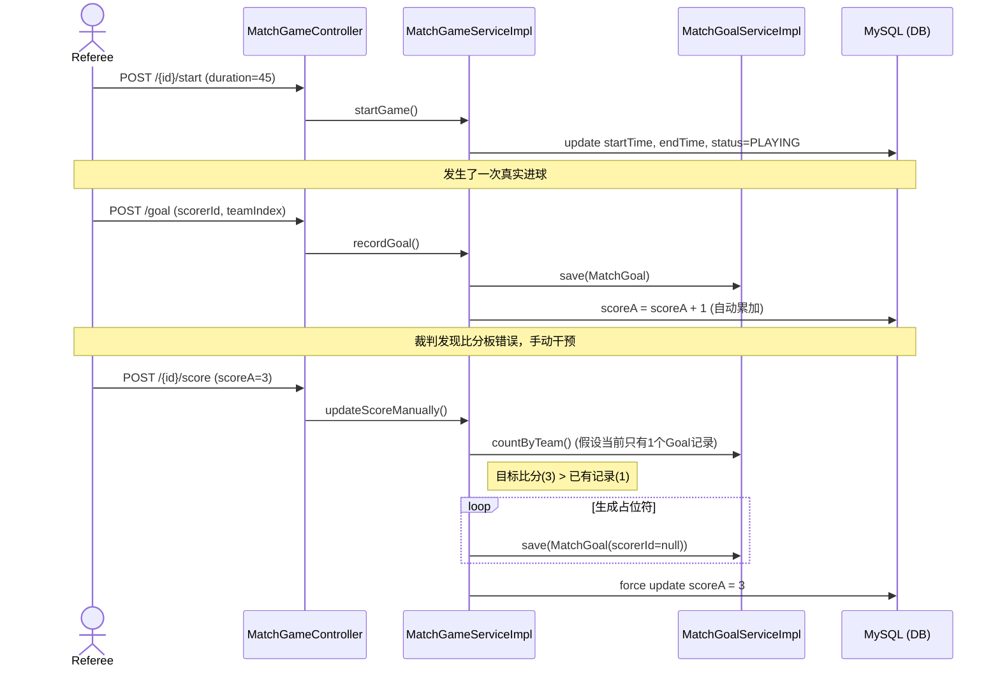

# 核心业务工作流 (Workflows)

## 1. 赛事生命周期状态机 (Match Event Lifecycle)

赛事流转遵循严格的状态机逻辑，包含管理员手动触发、基于时间的自动同步以及回退机制。



### 状态详细说明：
| 状态 | 说明 | 允许的操作 | 触发逻辑 | UI 语义与页面 |
| :--- | :--- | :--- | :--- | :--- |
| **PREPARING** | 筹备中 | 编辑、物理删除、开启报名 | 管理员创建时的初始状态 | **筹备中** (仅管理后台可见) |
| **PUBLISHED** | 报名中 | **球员报名**、撤回至筹备、修改时间 | 管理员点击“发布”或自动同步 | **报名中** (球员端可见) |
| **REGISTRATION_CLOSED** | 报名截止 | **无法报名**、可触发分组、可延长截止时间回跳 | 时间超过 `registrationDeadline` | **报名已截止** (球员可见) |
| **GROUPING_DRAFT** | 分组草稿 | **核心阶段**：微调分组、确认开赛 | 管理员触发自动分组算法 | **分组中** (排兵布阵/手动微调) |
| **ONGOING** | 比赛中 | 比分/进球录入、SSE 实时同步 | 确认分组并生成场次后进入 | **比赛中** (实时比分流) |
| **MATCH_FINISHED** | 待核算 | 修正数据、设置豁免、结算费用 | 管理员点击“完成比赛” | **待核算** (赛后数据审计) |
| **SETTLED** | 已完结 | 查看战报、查看费用分摊、**触发评分演进** | 管理员点击“结算费用” | **已完结** (战报与结算单) |
| **CANCELLED** | 已取消 | 无 | 管理员手动取消赛事 | **已取消** |

### 关键逻辑规则：
*   **状态自动同步 (`syncMatchStatusByTime`)**: 
    - 每次加载赛事详情或列表时，系统会自动检查当前时间并推进状态（如 `PUBLISHED` -> `REGISTRATION_CLOSED`）。
    - 若管理员将截止时间改回未来，状态会自动回跳（`REGISTRATION_CLOSED` -> `PUBLISHED`）。
*   **分组前提**: 只要赛事未开赛/未结束，管理员可随时重新触发分组算法生成草稿。
*   **费用分摊与豁免**:
    - 在 `MATCH_FINISHED` 阶段，管理员可标记特定人员 `isExempt`。
    - 结算时，总金额由 `(REGISTERED + NO_SHOW - EXEMPT)` 的人员向上取整平摊。


## 3. 赛事自动分组与场次生成时序图

该流程展示了从发布赛事、球员报名、到最终触发自动分组并生成对阵列表的全过程。



## 2. 比赛过程与比分演进时序图

该流程展示了比赛开始、进球记录（自动更新比分）、手动修改比分（占位符生成）的逻辑。



## 4. 个人开发范式 SOP

本章节用于约束本项目的日常研发方式，目标是让需求设计、编码实现、测试验证、部署发布和后续维护形成一套稳定、可重复、可沉淀的个人工程范式。

### 4.1 总原则

* **先定义再编码**：
    - 每次开始开发前，先明确需求目标、改动边界、影响模块和验收标准。
    - 禁止边写边补设计，尤其是涉及评分、赛事状态、报名、结算等核心域规则时。
* **数据库变更优先**：
    - 任何字段、表、索引、状态机、审计结构变动，优先补齐 Flyway migration。
    - `entity`、SQL、接口、文档必须保持一致，避免出现代码字段存在但数据库缺列的问题。
* **接口契约先于页面细节**：
    - 先明确请求参数、响应结构、异常场景，再进行前端页面接入。
    - 前端页面不承载核心业务规则，页面只做展示和交互。
* **小步提交，单一主题收口**：
    - 一次只解决一个明确问题。
    - 同一提交中尽量同时收口代码、迁移、文档、必要验证。
* **文档是交付物的一部分**：
    - 只要接口、数据模型、状态流、评分规则发生变化，就同步更新 `docs/`。
* **维护性优先于短期快写**：
    - 避免临时逻辑散落在 Controller 和页面。
    - 核心业务规则统一沉淀在 Service、Migration、文档中。

### 4.2 标准研发流程

#### 阶段一：需求澄清

每次开发前至少回答以下问题：

* **解决什么问题**
* **不解决什么问题**
* **影响哪些模块**
* **是否涉及数据库变更**
* **是否涉及接口契约变更**
* **验收标准是什么**

若以上问题无法回答清楚，不进入编码阶段。

#### 阶段二：设计

设计阶段至少输出以下内容：

* **目标定义**：
    - 本次改动的目标与边界。
* **影响面清单**：
    - 后端：`entity` / `mapper` / `service` / `controller` / `migration`
    - 前端：`api` / `type` / `page` / `component`
    - 文档：`API_SPEC` / `DATA_MODEL` / `ARCHITECTURE` / `TODO`
* **数据与状态变更**：
    - 是否新增字段、状态、索引、审计记录。
    - 是否影响旧数据兼容性。
* **风险点**：
    - 是否影响评分系统、赛事状态机、报名流程、费用结算、实时同步。

#### 阶段三：实现

推荐固定顺序如下：

1. **先写 Flyway migration**
2. **再改后端领域模型与业务逻辑**
3. **再收敛接口契约**
4. **最后接前端页面**
5. **同步更新文档**

实现阶段的约束：

* **Controller 只做编排**
* **Service 承载核心业务**
* **Migration 承载数据结构演进**
* **前端 API 层统一管理请求**
* **页面不硬编码核心规则**

#### 阶段四：验证

最低验证标准如下：

* **后端变更**：
    - 至少验证一个正常流程和一个失败流程。
* **数据库变更**：
    - 确认 migration 可执行。
    - 确认应用启动无 schema 漂移问题。
* **前端变更**：
    - 手工走通关键路径。
    - 检查成功态、空态、异常态。
* **核心域变更**：
    - 若涉及评分系统、赛事发布、报名、分组、结算，必须补关键链路回归验证。

#### 阶段五：部署

发布前检查项：

* **migration 已补齐**
* **本地启动通过**
* **核心接口可用**
* **关键页面可操作**
* **文档已同步**
* **Git 改动范围清晰**
* **提交信息能准确说明目的**

部署原则：

* **小步发布**
* **优先考虑历史数据兼容**
* **上线后立即验证核心链路**

#### 阶段六：维护

每周建议至少做一次维护性回顾：

* **清理过期 TODO**
* **检查文档与代码是否漂移**
* **复盘近期 bug 的根因**
* **抽取重复逻辑**
* **确认接口与数据库持续一致**

### 4.3 完成定义（Definition of Done）

一个需求只有同时满足以下条件，才算真正完成：

* **代码完成**
* **数据结构完成**
* **接口契约完成**
* **关键路径验证完成**
* **相关文档完成**
* **提交与交付可追溯**

### 4.4 本项目特别约束

以下类型的改动，默认视为高风险改动，必须同时检查 5 个方面：

* **数据库 migration**
* **Java entity/service**
* **前端 API/type**
* **docs 文档**
* **回归验证**

高风险改动包括但不限于：

* **评分系统**
* **赛事状态流转**
* **报名与取消规则**
* **费用结算**
* **实时比分与 SSE**

### 4.5 日常执行模板

#### 开工模板

```md
本次需求目标：
不做的范围：
影响模块：
是否涉及数据库：
是否涉及接口：
验收标准：
风险点：
```

#### 改动检查模板

```md
- migration 是否需要新增或修改
- entity / mapper / service / controller 是否同步
- frontend api / type / page 是否同步
- docs/API_SPEC.md 是否同步
- docs/DATA_MODEL.md 是否同步
- docs/ARCHITECTURE.md 或 docs/WORKFLOW.md 是否同步
- 是否需要补测试或手工验证
```

#### 提交前自检模板

```md
- 本地可启动
- 数据库迁移可执行
- 核心流程已验证
- 文档已更新
- 提交只包含一个明确主题
```
