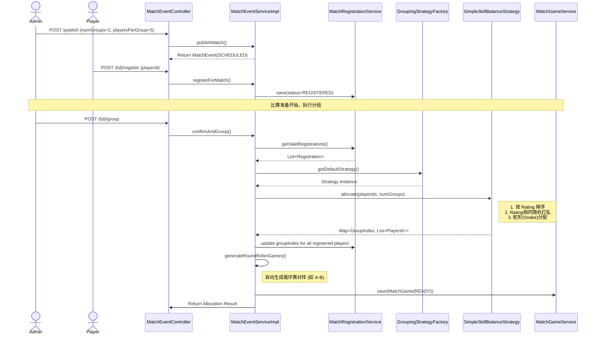

# 核心业务工作流 (Workflows)

## 1. 赛事生命周期与自动分组时序图

该流程展示了从发布赛事、球员报名、到最终触发自动分组并生成对阵列表的全过程。



## 2. 比赛过程与比分演进时序图

该流程展示了比赛开始、进球记录（自动更新比分）、手动修改比分（占位符生成）的逻辑。

```mermaid
sequenceDiagram
    actor Referee
    participant GameCtrl as MatchGameController
    participant GameSvc as MatchGameServiceImpl
    participant GoalSvc as MatchGoalServiceImpl
    database DB as MySQL

    Referee->>GameCtrl: POST /{id}/start (duration=45)
    GameCtrl->>GameSvc: startGame()
    GameSvc->>DB: update startTime, endTime, status=PLAYING
    
    Note over Referee, DB: 发生了一次真实进球

    Referee->>GameCtrl: POST /goal (scorerId, teamIndex)
    GameCtrl->>GameSvc: recordGoal()
    GameSvc->>GoalSvc: save(MatchGoal)
    GameSvc->>DB: scoreA = scoreA + 1 (自动累加)

    Note over Referee, DB: 裁判发现比分板错误，手动干预

    Referee->>GameCtrl: POST /{id}/score (scoreA=3)
    GameCtrl->>GameSvc: updateScoreManually()
    GameSvc->>GoalSvc: countByTeam() (假设当前只有1个Goal记录)
    Note right of GameSvc: 目标比分(3) > 已有记录(1)
    
    loop 生成占位符
        GameSvc->>GoalSvc: save(MatchGoal(scorerId=null))
    end
    
    GameSvc->>DB: force update scoreA = 3
```
