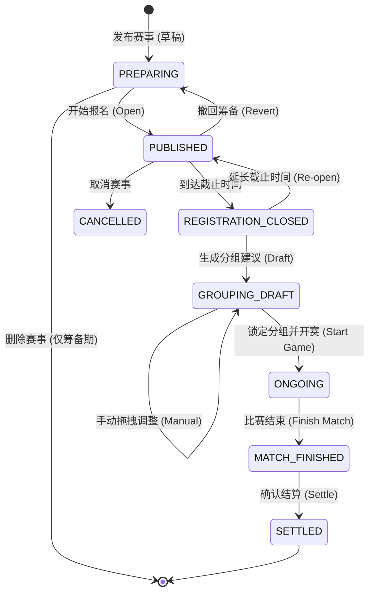
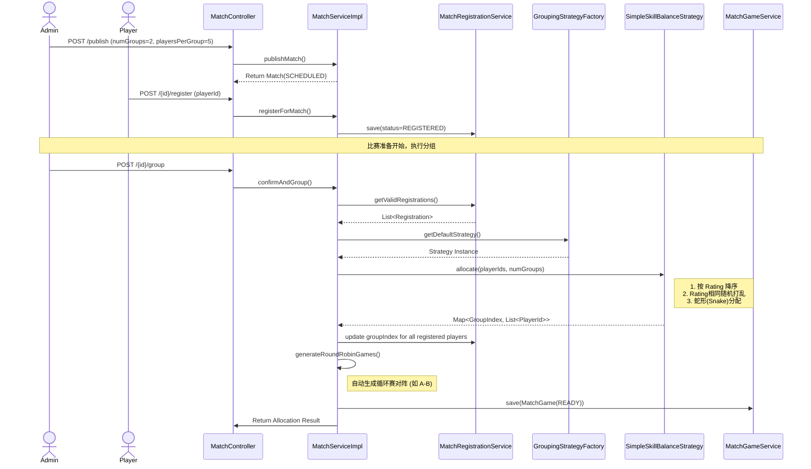
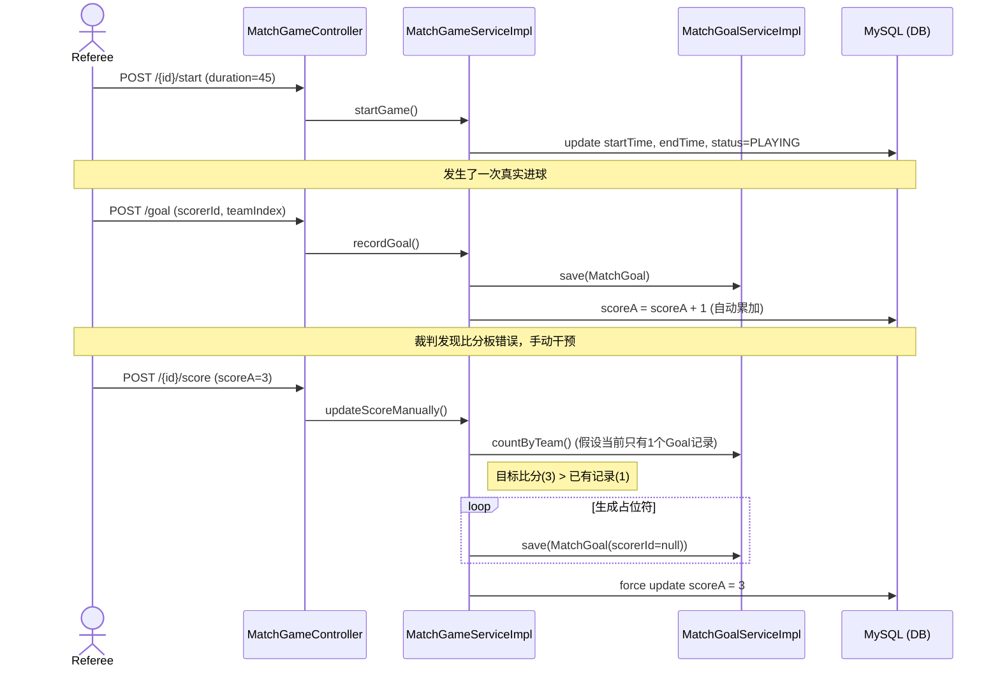

# 核心业务工作流 (Workflows)

## 1. 赛事生命周期状态机 (Match Event Lifecycle)

赛事流转遵循严格的状态机逻辑，管理员通过触发特定动作推动状态变更。

### 状态详细说明：
| 状态 | 说明 | 允许的操作 | 触发接口/代码 | UI 语义与页面 |
| :--- | :--- | :--- | :--- | :--- |
| **PREPARING** | 筹备中 | 编辑信息、**物理删除** | `publishMatch` (初始) | **筹备中** (管理后台编辑) |
| **PUBLISHED** | 报名阶段 | **球员报名**、撤回至筹备、修改截止时间 | `startRegistration` | **报名中** (球员报名页可见) |
| **REGISTRATION_CLOSED** | 报名锁定 | **延长截止时间回退至 PUBLISHED** | 时间触发或管理员修改 | **报名已截止** (等待分组) |
| **GROUPING_DRAFT** | 分组草稿 | **核心阶段**：执行算法生成草稿、管理员微调 | `confirmAndGroup` | **分组中** (排兵布阵/手动微调) |
| **ONGOING** | 比赛进行中 | 实时比分录入、进球审计 | `startWithGroups` | **比赛中** (实时比分/动态流) |
| **MATCH_FINISHED** | 待核算 | 手动修正数据、设置费用豁免 | `finishMatch` | **待核算** (赛后核对比分与数据) |
| **SETTLED** | 已结算 | 查看费用，**触发 ELO 评分演进** | `settleFees` | **已完结** (查看战报与费用单) |
| **CANCELLED** | 已取消 | 赛事终止 | `cancelMatch` | **已取消** (赛事失效) |

## 2. 核心控制逻辑规则
*   **撤回机制**：在 `PUBLISHED` 阶段若未进入分组，管理员可手动回退至 `PREPARING`。
*   **报名动态开关**：
    - 是否允许报名取决于 `(status == PUBLISHED && now < registrationDeadline)`。
    - **自动翻转**：若当前状态为 `REGISTRATION_CLOSED` 且管理员将截止时间修改为未来，状态应自动回退为 `PUBLISHED`。
*   **费用结算与评分演进**：
    - 状态转为 `SETTLED` 时自动发布 `MatchSettledEvent`。

## 3. 赛事自动分组与场次生成时序图

该流程展示了从发布赛事、球员报名、到最终触发自动分组并生成对阵列表的全过程。

## 2. 比赛过程与比分演进时序图

该流程展示了比赛开始、进球记录（自动更新比分）、手动修改比分（占位符生成）的逻辑。

